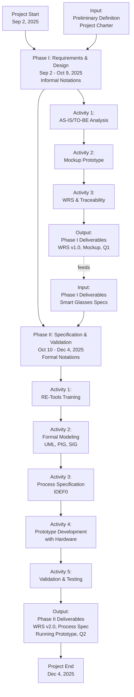
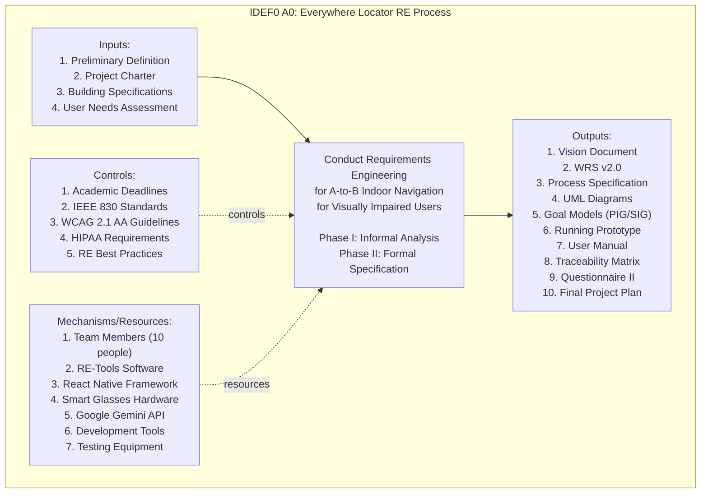
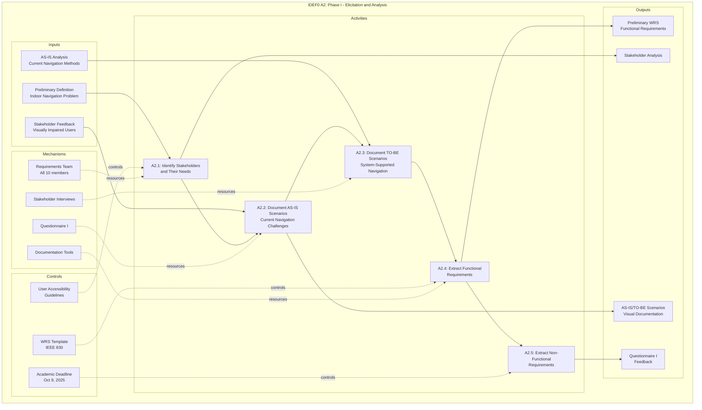
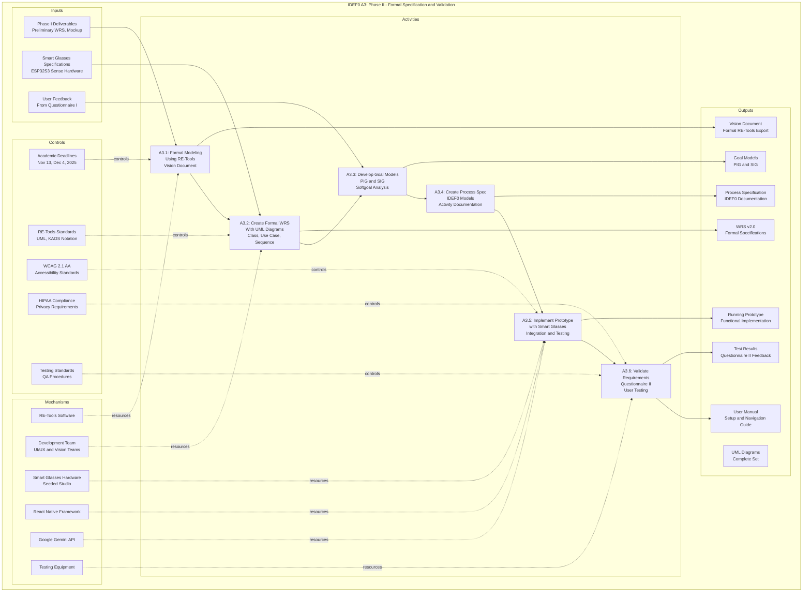
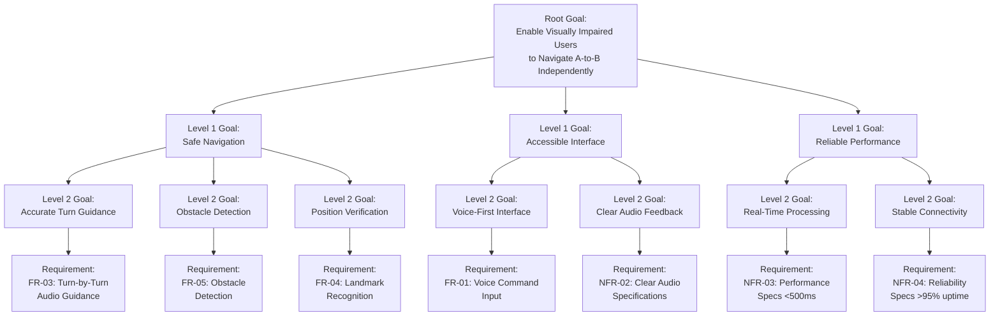
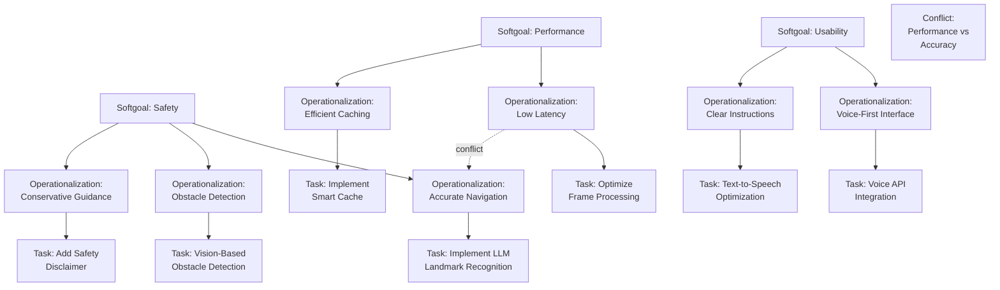
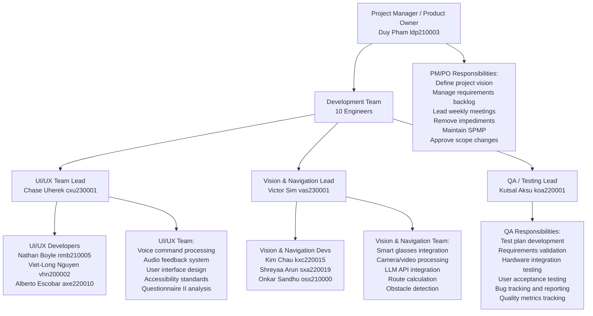
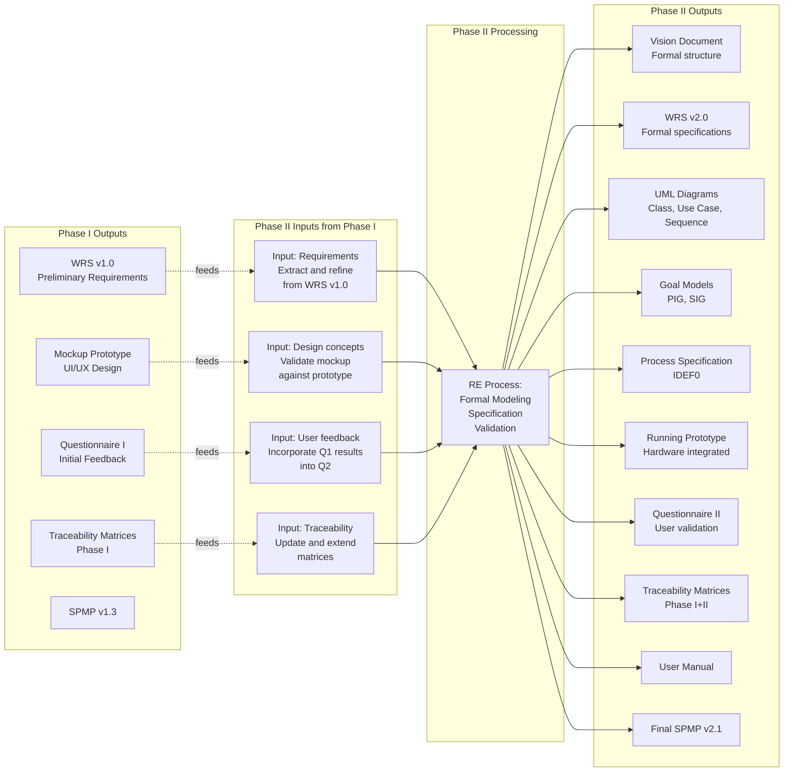

# Process Specification - Everywhere Locator

**Version:** 2.0  
**Date:** November 4, 2025  
**Project:** Everywhere Locator - A-to-B Indoor Navigation for Visually Impaired Users  
**Team URL:** https://everywhere-locator.vercel.app

## Overview

### Process Specification Purpose

The Process Specification documents the Requirements Engineering (RE) process followed by the Everywhere Locator team across Phase I and Phase II. It describes:

- **Functional Process:** The activities, methods, and workflows used for requirements elicitation, analysis, specification, and validation
- **Non-Functional Process:** The goals, constraints, and quality attributes driving the RE process
- **Process Iterations:** How Phase I informed and fed into Phase II
- **Team Organization:** Roles, responsibilities, and communication structures
- **Quality Assurance:** Reviews, validations, and continuous improvement mechanisms

### Process Objectives

1. Document systematic RE approach for A-to-B indoor navigation system
2. Show evolution from informal (Phase I) to formal (Phase II) modeling
3. Establish traceability from business needs through specifications to implementation
4. Enable reproducibility and continuous process improvement
5. Support academic evaluation and knowledge transfer

---

## RE Process Model

### Two-Phase RE Process



---

# IDEF0 Functional Process Models

## A0 Context Diagram

### Top-Level RE Process



---

## A1 Phase I and Phase II Decomposition

### High-Level RE Activities

```mermaid
graph TB
    subgraph "IDEF0 A1: Phase I and Phase II Activities"
        
        A1_1["A1.1: Elicit Requirements<br/>from Stakeholders<br/>AS-IS/TO-BE Analysis"]
        
        A1_2["A1.2: Analyze and Negotiate<br/>Requirements<br/>Preliminary WRS Creation"]
        
        A1_3["A1.3: Create Mockup Prototype<br/>UI/UX Design<br/>Validation through Design"]
        
        A1_4["A1.4: Document and Trace<br/>Phase I WRS<br/>Traceability Matrices"]
        
        A1_5["A1.5: Conduct Validation<br/>Questionnaire I<br/>Stakeholder Review"]
        
        PHASE1_PASS["Phase I Output:<br/>Informal Requirements<br/>Mockup Prototype<br/>Initial Questionnaire"]
        
        A2_1["A2.1: Formal Modeling<br/>Using RE-Tools<br/>Vision Document, WRS v2.0"]
        
        A2_2["A2.2: Create IDEF0 Models<br/>Process Specification<br/>Activity Decomposition"]
        
        A2_3["A2.3: Develop UML Diagrams<br/>Class, Use Case, Sequence<br/>System Architecture"]
        
        A2_4["A2.4: Build Goal Models<br/>PIG, SIG<br/>Softgoal Analysis"]
        
        A2_5["A2.5: Implement Prototype<br/>with Smart Glasses Hardware<br/>Integration and Testing"]
        
        A2_6["A2.6: Validate with Users<br/>Questionnaire II<br/>Testing and Feedback"]
        
        A2_7["A2.7: Document Finalization<br/>User Manual<br/>Traceability Updates"]
        
        PHASE2_PASS["Phase II Output:<br/>Formal Requirements<br/>Running Prototype<br/>Complete Documentation"]
        
        A1_1 --> A1_2
        A1_2 --> A1_3
        A1_3 --> A1_4
        A1_4 --> A1_5
        A1_5 --> PHASE1_PASS
        
        PHASE1_PASS -.feeds.-> A2_1
        
        A2_1 --> A2_2
        A2_1 --> A2_3
        A2_1 --> A2_4
        A2_3 --> A2_5
        A2_4 --> A2_5
        A2_5 --> A2_6
        A2_6 --> A2_7
        A2_7 --> PHASE2_PASS
        
    end
```



---

## A2 Phase I Requirements Elicitation

### Phase I Detailed Activities with IDEF0 Categories



---

## A3 Phase II Specification and Validation

### Phase II Detailed Activities with IDEF0 Categories



---

# KAOS Goal Refinement Process

## Goal-Driven Requirements Derivation



---

# NFR Framework - Non-Functional Modeling

## Softgoal Contribution Process



---

# Process Activities and Roles

## Team Organization and Responsibilities



---

# Iteration Cycles

## Phase I Iteration Cycle (Weekly)

### Week 1-2: Sep 2 - Sep 15, 2025

```
Iteration 1 Focus: Stakeholder Analysis and AS-IS Scenarios

Inputs:
  - Preliminary definition from course
  - Stakeholder contact information
  - Building information

Activities:
  - Conduct stakeholder interviews
  - Document current navigation challenges
  - Identify user pain points
  - Create AS-IS scenario documentation

Outputs:
  - Stakeholder analysis document
  - AS-IS scenario descriptions
  - Identified needs and goals

Review Meeting:
  - Present AS-IS findings to team
  - Identify gaps and questions
  - Plan next iteration

Progress: On Track
Issues: None significant
```

### Week 3: Sep 16 - Sep 22, 2025

```
Iteration 2 Focus: Requirements Definition

Inputs:
  - Stakeholder feedback from Week 1-2
  - AS-IS analysis
  - Accessibility guidelines (WCAG 2.1 AA)

Activities:
  - Define TO-BE scenarios
  - Extract functional requirements
  - Extract non-functional requirements
  - Create preliminary WRS

Outputs:
  - TO-BE scenario descriptions
  - Functional requirements list (7 FRs, 7 NFRs)
  - Preliminary WRS document

Review Meeting:
  - Walkthrough requirements with stakeholders
  - Clarify ambiguities
  - Gather feedback

Progress: On Track
Issues: Scope ambiguity resolved (confirmed A-to-B navigation)
```

### Week 4: Sep 23 - Sep 30, 2025

```
Iteration 3 Focus: Mockup Prototype and Validation

Inputs:
  - Requirements from Week 3
  - Design guidelines
  - Accessibility principles

Activities:
  - Create UI/UX mockups
  - Design navigation interface
  - Document user workflows
  - Develop Questionnaire I

Outputs:
  - Mockup prototype (Figma or similar)
  - User workflows documentation
  - Questionnaire I (for validation)
  - Traceability matrices (initial)

Review Meeting:
  - Demo mockup to stakeholders
  - Collect design feedback
  - Validate user workflows
  - Gather questionnaire responses

Progress: On Track
Issues: Minor design revisions needed
```

### Week 5: Oct 1 - Oct 9, 2025

```
Iteration 4 Focus: Finalization and Phase I Submission

Inputs:
  - Feedback from Week 4
  - All phase 1 artifacts
  - Questionnaire I results

Activities:
  - Refine WRS based on feedback
  - Update mockup prototype
  - Complete traceability matrices
  - Calculate requirements creeping rate
  - Prepare presentation

Outputs:
  - Final WRS v1.0
  - Final mockup prototype
  - Compact and Full Traceability Matrices
  - Requirements Creeping Rate: 114.3%
  - Phase I Presentation slides

Final Review:
  - Internal team review
  - Quality check all deliverables
  - Prepare for submission

Progress: On Track
Issues Resolved: Scope clarification complete
Submission: Oct 9, 2025 at 11:59 PM
```

---

## Phase II Iteration Cycle (Weekly)

### Week 1: Oct 10 - Oct 18, 2025

```
Iteration 1 Focus: RE-Tools Training and Hardware Setup

Inputs:
  - Phase I deliverables
  - RE-Tools software and tutorials
  - Smart glasses hardware specifications

Activities:
  - Team RE-Tools training (all members)
  - Download and install RE-Tools
  - Practice with RE-Tools tutorials
  - Unbox and test smart glasses hardware
  - Establish hardware-phone communication baseline

Outputs:
  - Team RE-Tools proficiency certified
  - Smart glasses connection protocol validated
  - Hardware communication test results
  - RE-Tools project templates created

Review Meeting:
  - Verify all team members trained on RE-Tools
  - Confirm hardware connectivity working
  - Plan formal modeling activities

Progress: On Track
Issues: Minor RE-Tools learning curve, resolved with tutorials
```

### Week 2: Oct 19 - Oct 27, 2025

```
Iteration 2 Focus: Vision Document and Formal WRS Start

Inputs:
  - Phase I WRS v1.0
  - Vision Document requirements
  - RE-Tools formal modeling tools
  - Smart glasses integration requirements

Activities:
  - Create Vision Document in RE-Tools
  - Begin WRS v2.0 formal specification
  - Create UML Use Case diagram
  - Define formal requirements structure
  - Start goal modeling (KAOS approach)

Outputs:
  - Vision Document draft (RE-Tools)
  - WRS v2.0 skeleton (RE-Tools)
  - UML Use Case Diagram
  - Goal hierarchy beginning

Review Meeting:
  - Vision Document walkthrough
  - WRS structure review
  - Requirements mapping to goals

Progress: On Track
Issues: Slight delays in RE-Tools template creation
```

### Week 3: Oct 28 - Nov 4, 2025

```
Iteration 3 Focus: Formal Models and Hardware Integration Design

Inputs:
  - Draft Vision and WRS documents
  - Hardware integration requirements
  - Formal modeling standards

Activities:
  - Complete Vision Document
  - Create UML Class diagram
  - Create UML Sequence diagram
  - Develop PIG (Personal Interdependency Graph)
  - Develop SIG (Softgoal Interdependency Graph)
  - Design smart glasses-phone communication protocol
  - Create IDEF0 initial decomposition

Outputs:
  - Final Vision Document (RE-Tools export)
  - Complete UML diagram set (Class, Use Case, Sequence)
  - PIG and SIG models
  - Hardware communication protocol design
  - IDEF0 A0-A1 diagrams

Review Meeting:
  - Model completeness review
  - Hardware protocol validation
  - Process specification discussion

Progress: On Track
Issues: None significant
```

### Week 4: Nov 5 - Nov 13, 2025

```
Iteration 4 Focus: Interim Submission Preparation

Inputs:
  - All formal models
  - Hardware protocol design
  - Interim submission requirements

Activities:
  - Finalize WRS v2.0 with all formal specifications
  - Complete Process Specification (IDEF0 documentation)
  - Develop Questionnaire II
  - Create interim progress report
  - Prepare all submissions in RE-Tools format
  - Package deliverables for submission

Outputs:
  - Vision Document (final, RE-Tools export)
  - WRS v2.0 (complete, RE-Tools export)
  - Process Specification (IDEF0 with documentation)
  - Questionnaire II
  - Interim Progress Report
  - Updated SPMP v2.1

Interim Submission:
  - All deliverables packaged
  - Quality assurance review completed
  - Submission deadline: Nov 13, 2025 at 11:59 PM

Progress: On Track
Issues: None significant
```

### Week 5: Nov 14 - Nov 22, 2025

```
Iteration 5 Focus: Prototype Development and Integration

Inputs:
  - Formal specifications (Vision, WRS v2.0)
  - Smart glasses hardware
  - React Native framework setup
  - LLM API specifications

Activities:
  - Implement core navigation UI in React Native
  - Integrate smart glasses video transmission
  - Implement route calculation algorithm
  - Implement landmark recognition pipeline
  - Implement obstacle detection
  - Implement turn-by-turn audio guidance
  - Begin hardware-software integration testing

Outputs:
  - Running prototype with:
    - Voice command input working
    - Route calculation functioning
    - Audio feedback system operational
    - Basic smart glasses integration
  - Integration test results
  - Hardware communication logs

Review Meeting:
  - Prototype walkthrough
  - Integration test results review
  - Performance metrics assessment
  - Issues and blockers identification

Progress: On Track
Issues: Minor audio latency optimization needed
```

### Week 6: Nov 23 - Nov 30, 2025

```
Iteration 6 Focus: Validation and User Testing

Inputs:
  - Running prototype
  - Questionnaire II
  - Target buildings for testing

Activities:
  - Conduct real-world navigation testing
  - Test in 1-2 target buildings
  - Gather user feedback via Questionnaire II
  - Verify requirement satisfaction
  - Document test results
  - Begin user manual creation

Outputs:
  - User testing results
  - Questionnaire II responses analyzed
  - Requirements validation report
  - User manual draft
  - Test case results

Review Meeting:
  - Test results presentation
  - User feedback analysis
  - Requirements satisfaction assessment
  - Next steps for final iteration

Progress: On Track
Issues: Minor adjustments to audio feedback based on user feedback
```

### Week 7: Dec 1 - Dec 4, 2025

```
Iteration 7 Focus: Final Preparation and Submission

Inputs:
  - Validated prototype
  - All test results
  - User feedback
  - Final presentation requirements

Activities:
  - Finalize prototype for demonstration
  - Complete user manual
  - Create presentation slides
  - Finalize traceability documentation
  - Prepare final project plan
  - Package all deliverables
  - Prepare demo hardware setup

Outputs:
  - Final running prototype (demo-ready)
  - Final User Manual
  - Presentation slides
  - Complete Traceability Matrix
  - Final Project Plan (v2.1)
  - All documentation finalized

Final Submission:
  - All deliverables packaged in ZIP
  - Submission deadline: Dec 4, 2025 at 11:59 PM
  - Presentations: Dec 2 and Dec 4, 2025
  - Hardcopy submitted in class

Progress: On Track
Issues: None significant
```

---

# Input-Output Traceability

## Phase I to Phase II Artifact Traceability



---

# Quality Assurance Process

## Review and Validation Procedures

### Requirement Reviews

```
Phase I Requirement Review Process:

1. Developer Review (Self-Check)
   - Check requirement clarity
   - Verify traceability
   - Check for ambiguity
   - Timeline: 1 hour per requirement

2. Team Lead Review
   - UI/UX Lead for UI requirements
   - Vision & Nav Lead for navigation requirements
   - Check consistency with design
   - Identify conflicts
   - Timeline: 30 minutes per requirement
   
3. PM/PO Review
   - Check alignment with vision and goals
   - Verify stakeholder coverage
   - Check acceptance criteria
   - Approve or request changes
   - Timeline: 30 minutes per requirement

4. QA Review
   - Check testability
   - Verify measurability
   - Identify testing approach
   - Flag potential issues
   - Timeline: 30 minutes per requirement

5. Stakeholder Review (Q1)
   - Present requirements to users
   - Gather feedback
   - Incorporate suggestions
   - Timeline: 1 week

Review Acceptance Criteria:
- No major clarity issues
- Traceability established
- Testable and measurable
- Stakeholder approval
- No critical conflicts
```

### Prototype Validation

```
Phase II Prototype Validation Process:

1. Functional Testing
   - Voice command input: accuracy >90%
   - Route calculation: success >90%
   - Landmark recognition: accuracy >85%
   - Obstacle detection: detection rate >95%
   - Audio latency: <500ms
   - Bluetooth stability: >95% uptime
   - Timeline: 2 weeks

2. Hardware Integration Testing
   - Smart glasses connection: <10 seconds
   - Video transmission: 5+ FPS
   - Battery life: 2+ hours
   - Reconnection: <15 seconds
   - Timeline: 1 week

3. User Acceptance Testing
   - Real-world navigation testing
   - Questionnaire II feedback
   - Usability testing
   - Accessibility verification
   - Timeline: 1 week

4. Safety and Compliance Review
   - Safety disclaimer display
   - WCAG 2.1 AA compliance
   - HIPAA statement presence
   - Emergency procedures
   - Timeline: 2 days

Acceptance Criteria:
- All functional requirements met
- Hardware integration stable
- User feedback positive (4.0+/5.0)
- No safety issues identified
- Compliance verified
```

### Documentation Quality Gates

```
Documentation Review Process:

1. Content Review
   - Completeness check
   - Accuracy verification
   - Consistency check
   - Clarity assessment
   - Timeline: 1 week

2. Format Review
   - RE-Tools format compliance
   - Diagram quality
   - Reference correctness
   - Formatting consistency
   - Timeline: 2 days

3. Traceability Review
   - Requirements traced to source
   - Bidirectional traceability
   - No orphaned requirements
   - Consistency across documents
   - Timeline: 2 days

4. Stakeholder Review
   - Presentation to stakeholders
   - Feedback incorporation
   - Approval obtained
   - Timeline: 1 week

Acceptance Criteria:
- All required sections present
- RE-Tools format compliant
- Traceability complete
- Stakeholder approved
- No critical issues remaining
```

---

# Revision History

| Version | Date | Author | Changes |
|---------|------|--------|---------|
| 1.0 | Oct 9, 2025 | Duy Pham (ldp210003) | Phase I process documentation |
| 2.0 | Nov 4, 2025 | Duy Pham (ldp210003) | Phase II: Complete process specification with IDEF0 models (A0-A3), KAOS goal refinement, NFR Framework modeling, detailed iteration cycles, quality assurance procedures, and comprehensive input-output traceability between Phase I and Phase II. |

---

## Appendix A: IDEF0 Notation Summary

### IDEF0 Components

```
Inputs:
  - Data/materials that flow INTO an activity
  - Inputs are transformed by the process
  - Inputs come from the left
  
Activities/Processes:
  - Defined as boxes
  - Represent work or transformation
  - Connected by arrows showing flow

Controls:
  - Constraints or policies guiding the process
  - Enter from the top
  - Dashed lines indicate control relationship
  
Mechanisms/Resources:
  - Tools, people, systems needed for process
  - Enter from the bottom
  - Dashed lines indicate resource relationship

Outputs:
  - Results of the process
  - Products, documents, decisions
  - Exit to the right
```

### Decomposition Hierarchy

```
A0: Context Diagram
  Shows single process in business context
  
A1: Top-Level Decomposition
  Process broken into 3-6 subprocesses
  
A2: Second-Level Decomposition
  Each A1 subprocess broken into 3-6 activities
  
A3: Third-Level Decomposition
  Detailed activity breakdown (if needed)
  
Typical Decomposition: 3-4 levels maximum
```

---

## Appendix B: Process Metrics

### Phase I Metrics

```
Timeline: 5 weeks (Sep 2 - Oct 9, 2025)

Deliverables:
- 1 WRS document (preliminary)
- 1 Mockup prototype
- 2 Traceability matrices
- 1 Questionnaire
- 1 Presentation

Team Effort:
- Total: 500 person-hours
- Per person: 50 hours average
- Requirements focus: 60%
- Design focus: 30%
- Documentation focus: 10%

Meetings:
- Weekly: 5 meetings
- Average duration: 1 hour each
- Total time: 5 hours

Issues Identified: 4
Issues Resolved: 4
Resolution Rate: 100%

Scope Changes: 1 major (A-to-B vs object finding)
- Resolved in Week 2
- No impact to timeline
```

### Phase II Metrics (Projected)

```
Timeline: 6 weeks (Oct 10 - Dec 4, 2025)

Deliverables:
- 1 Vision Document (formal)
- 1 WRS v2.0 (formal with UML)
- 1 Process Specification (IDEF0)
- 3 UML Diagrams
- 2 Goal Models (PIG, SIG)
- 1 Running Prototype
- 1 User Manual
- 1 Questionnaire II
- 1 Updated Traceability Matrix
- 1 Final SPMP v2.1

Team Effort:
- Total: 600 person-hours
- Per person: 60 hours average
- Formal modeling: 40%
- Prototype development: 40%
- Documentation: 15%
- Testing and validation: 5%

Meetings:
- Weekly: 6 meetings
- Interim review: 1 meeting
- Final presentation prep: 2 meetings
- Total: 9 meetings
- Average duration: 1.5 hours each
- Total time: 13.5 hours

Expected Issues: 3-4
- Hardware integration (1)
- API latency (1)
- Timeline pressure (1)
- Possible: Requirements ambiguity (1)
```

---

## Appendix C: Process Improvement Recommendations

### For Future Projects

```
1. Requirements Elicitation
   - Conduct formal stakeholder workshops
   - Use structured interview techniques
   - Document assumptions explicitly
   - Perform requirements sanity checks early

2. Modeling Approach
   - Introduce formal modeling earlier (Phase I)
   - Use modeling tools from project start
   - Build incremental formal models
   - Integrate formal and informal notations

3. Team Communication
   - Establish daily stand-ups (15 minutes)
   - Weekly detailed status meetings
   - Shared requirements tracking
   - Clear escalation procedures

4. Quality Assurance
   - Implement peer reviews for all artifacts
   - Create checklist-based QA procedures
   - Automated traceability checks
   - Regular stakeholder walkthroughs

5. Documentation
   - Use single source of truth
   - Version control for all documents
   - Continuous documentation updates
   - Clear change tracking

6. Hardware Integration
   - Prototype hardware integration early
   - Build modular interfaces
   - Implement fallback mechanisms
   - Test integration continuously
```
