# Workshop Requirements Specification (WRS) - Everywhere Locator Phase II

**Version:** 2.0  
**Date:** November 4, 2025  
**Project:** Everywhere Locator - A-to-B Indoor Navigation for Visually Impaired Users  
**Team URL:** https://everywhere-locator.vercel.app  
**Document URL:** https://github.com/phamleduy04/se4351-mobile-f25/blob/main/docs/Project%202/WRS%20Project%202.md

---

# World Section (W)

## Stakeholder Definition

### For: Beneficiaries


### Of: Subject


### By: Clients/Developers


---

## Problem Description

### Current State Problems


### Root Cause Analysis

| Problem Area | Root Cause | Contributing Factors |
|---|---|---|
| **No Indoor Positioning** | GPS unreliable indoors; no landmark database | Lack of indoor mapping infrastructure; cost of deployment |
| **No Route Planning** | No accessible routing algorithms; limited maps | Complex building layouts; private building data |
| **No Real-Time Guidance** | No mobile assistive navigation solutions | Accessibility market too small; high development cost |
| **Limited Obstacle Detection** | Only canes provide obstacle awareness | Computer vision not optimized for accessibility |
| **No Position Verification** | No visual landmark recognition for blind users | Visual data not leveraged for blind navigation |
| **Dependency on Others** | Traditional solutions unchanged in decades | Technology adoption lag in accessibility |

---

## Goal Statement

### Primary Goal

```
Enable visually impaired individuals to navigate independently from 
any Point A to any Point B in complex indoor environments using intelligent 
mobile technology with real-time audio guidance, landmark verification, 
and obstacle detection.
```

### Goal Decomposition


---

## Domain Definition

### Indoor Navigation Domain Characteristics


---

# Requirements Section (R)

## Functional Requirements

### FR-01: Accept Destination Location via Voice Command

**Requirement ID:** FR-01  
**Priority:** High  
**Status:** Active

**Requirement Statement:**
The system shall accept a destination location from the user via natural language voice command, process the user's spoken input, parse the destination name, and confirm understanding with the user before proceeding with route calculation.

**Detailed Requirements:**

```
FR-01.1: The system shall activate voice input when the user requests 
         "Take me to" or similar navigation commands.

FR-01.2: The system shall process voice commands lasting 5-30 seconds 
         with at least 90% accuracy for destination names within the 
         building database.

FR-01.3: The system shall provide feedback confirming the understood 
         destination (e.g., "Did you say Room 301?") before calculating 
         the route.

FR-01.4: The system shall handle ambiguous destination names by presenting 
         alternative matches (e.g., multiple Room 301s on different floors).

FR-01.5: The system shall support common location types: rooms (e.g., "Room 301"), 
         facilities (e.g., "cafeteria", "restroom"), landmarks (e.g., "elevator lobby").

FR-01.6: The system shall allow voice command cancellation or correction 
         with "cancel", "repeat", or "try again" commands.
```

**Related Goals:** G1 (Enable User to Specify Destination)  
**Related Use Cases:** UC-01 (Navigate to Destination)  
**Validation Method:** User testing with Questionnaire II, Section 3

---

### FR-02: Calculate Route from Point A to Point B

**Requirement ID:** FR-02  
**Priority:** High  
**Status:** Active

**Requirement Statement:**
The system shall calculate an optimal indoor route from the user's current location (Point A) to the specified destination (Point B) using building maps, pathfinding algorithms, and accessibility constraints.

**Detailed Requirements:**

```
FR-02.1: The system shall load building maps for the target facility 
         and identify the current floor and location.

FR-02.2: The system shall calculate the route considering:
         - Shortest distance or time
         - Accessibility (no stairs/elevators based on user preferences)
         - Landmarks for verification points
         - Safety margins around obstacles

FR-02.3: The system shall identify key decision points (turns, elevator, 
         floor changes) where landmark verification will occur.

FR-02.4: The system shall estimate travel time and total distance before 
         starting navigation.

FR-02.5: The system shall provide alternative routes if the primary route 
         is blocked or unavailable.

FR-02.6: The system shall handle multi-floor navigation including elevator 
         or stair directions.

FR-02.7: The system shall support route recalculation if the user deviates 
         from the planned path.
```

**Related Goals:** G2 (Calculate Route A to B)  
**Related Use Cases:** UC-01 (Navigate to Destination)  
**Validation Method:** Route calculation accuracy testing in real buildings

---

### FR-03: Provide Turn-by-Turn Audio Guidance

**Requirement ID:** FR-03  
**Priority:** Critical  
**Status:** Active

**Requirement Statement:**
The system shall provide clear, concise turn-by-turn audio instructions guiding the user from the current location toward the destination, with real-time updates as the user moves.

**Detailed Requirements:**

```
FR-03.1: The system shall provide initial route overview before navigation 
         starts: "Route calculated. 5 turns, 220 feet, about 3 minutes."

FR-03.2: The system shall provide continuous walking instructions: 
         "Walk straight ahead for 50 feet."

FR-03.3: The system shall warn of upcoming turns: 
         "In 20 feet, turn right at the water fountain."

FR-03.4: The system shall confirm turn execution: 
         "Turn right now. Elevator lobby ahead, 30 feet."

FR-03.5: The system shall provide distance in both feet and steps 
         (e.g., "50 feet" or "approximately 35 steps").

FR-03.6: The system shall provide time estimates to decision points 
         (e.g., "about 2 minutes to the next turn").

FR-03.7: The system shall confirm arrival: 
         "You have arrived at Meeting Room 301."

FR-03.8: The system shall allow adjustment of audio speed 
         (slow/normal/fast) for user preference.

FR-03.9: The system shall allow adjustment of audio volume 
         (0-100 percent).

FR-03.10: The system shall pause navigation audio if user voice command 
          is detected, then resume afterward.
```

**Related Goals:** G3 (Guide User with Turn-by-Turn Audio)  
**Related Use Cases:** UC-01 (Navigate to Destination)  
**Validation Method:** User testing, clarity ratings in Questionnaire II, Section 3

---

### FR-04: Recognize Landmarks from Smart Glasses Video

**Requirement ID:** FR-04  
**Priority:** High  
**Status:** Active

**Requirement Statement:**
The system shall process video frames from the smart glasses camera, use LLM-based visual recognition to identify landmarks, and provide feedback to confirm the user's position along the route.

**Detailed Requirements:**

```
FR-04.1: The system shall continuously receive video frames from the smart 
         glasses at a minimum of 5 frames per second.

FR-04.2: The system shall process frames through Google Gemini API (or similar 
         LLM) to identify objects and landmarks within the frame.

FR-04.3: The system shall match identified landmarks against expected 
         landmarks at the current navigation step.

FR-04.4: The system shall confirm position when landmark matches expected 
         location: "Confirmed at water fountain junction."

FR-04.5: The system shall achieve minimum 85 percent accuracy in landmark 
         recognition for trained landmark set (5-10 common buildings landmarks).

FR-04.6: The system shall handle landmark ambiguity by requesting additional 
         context (e.g., "look to your left for additional confirmation").

FR-04.7: The system shall cache landmark recognition results to reduce API 
         calls and improve performance.

FR-04.8: The system shall provide estimated confidence level for landmark 
         identification to determine if verification is reliable.
```

**Related Goals:** G4 (Verify Position Using Landmarks)  
**Related Use Cases:** UC-01 (Navigate to Destination), UC-04 (Verify Position)  
**Validation Method:** Landmark recognition accuracy testing, API call monitoring

---

### FR-05: Detect Obstacles in Navigation Path

**Requirement ID:** FR-05  
**Priority:** Critical  
**Status:** Active

**Requirement Statement:**
The system shall analyze video frames from smart glasses to detect obstacles (people, furniture, barriers) in the user's navigation path and provide real-time warnings.

**Detailed Requirements:**

```
FR-05.1: The system shall process video frames to detect objects using 
         computer vision techniques.

FR-05.2: The system shall classify detected objects as:
         - Moving obstacles (people, vehicles)
         - Stationary obstacles (furniture, equipment, barriers)
         - Environmental hazards (open doors, stairs, edges)

FR-05.3: The system shall achieve minimum 95 percent detection rate for 
         obstacles in the direct navigation path.

FR-05.4: The system shall provide warning when obstacle detected: 
         "Caution: obstacle ahead."

FR-05.5: The system shall provide 2-3 second advance warning before 
         obstacle is reached at normal walking speed.

FR-05.6: The system shall suggest avoidance directions if possible: 
         "Move slightly to the left to avoid obstacle."

FR-05.7: The system shall recommend stopping if safe passage is not 
         available: "Path blocked. Please stop and ask for assistance."

FR-05.8: The system shall distinguish between stationary obstacles 
         and temporary obstruction (e.g., person momentarily in way).
```

**Related Goals:** G5 (Detect and Warn of Obstacles)  
**Related Use Cases:** UC-01 (Navigate to Destination)  
**Validation Method:** Obstacle detection testing in varied environments, safety assessment

---

### FR-06: Manage Smart Glasses Hardware Connection

**Requirement ID:** FR-06  
**Priority:** High  
**Status:** Active

**Requirement Statement:**
The system shall establish, maintain, and manage Bluetooth connection with smart glasses hardware, handle disconnections gracefully, and provide user with connection status feedback.

**Detailed Requirements:**

```
FR-06.1: The system shall scan for available smart glasses devices using 
         Bluetooth LE protocol.

FR-06.2: The system shall establish Bluetooth connection with the paired 
         smart glasses device on application launch.

FR-06.3: The system shall receive video frames from smart glasses via 
         Bluetooth at 5+ frames per second.

FR-06.4: The system shall detect disconnection events (connection loss, 
         glasses powered off, out of range).

FR-06.5: The system shall automatically attempt reconnection every 3 seconds 
         up to 10 attempts when disconnected.

FR-06.6: The system shall display connection status to user: "Connected", 
         "Connecting", "Disconnected", "Low Signal".

FR-06.7: The system shall warn user if connection is unstable: 
         "Connection unstable. Signal quality low."

FR-06.8: The system shall pause navigation if connection is lost for more 
         than 5 seconds and alert user: "Connection lost. Navigation paused."

FR-06.9: The system shall allow manual reconnection attempt by user voice 
         command: "Reconnect glasses".

FR-06.10: The system shall implement connection timeout of 30 seconds 
          during initial pairing attempt.

FR-06.11: The system shall monitor smart glasses battery level and display 
          to user (if available).

FR-06.12: The system shall warn user when glasses battery is below 20 percent.
```

**Related Goals:** G6 (Maintain Connection to Smart Glasses)  
**Related Use Cases:** UC-06 (Connect Smart Glasses)  
**Validation Method:** Hardware connection testing, stability monitoring

---

## Non-Functional Requirements

### NFR-01: Safety

**Requirement ID:** NFR-01  
**Priority:** Critical  
**Status:** Active

**Requirement Statement:**
The system shall be positioned and function as an assistive navigation aid only, not as a replacement for primary mobility devices (cane, guide dog) or human assistance. The system shall provide conservative guidance with safety margins to minimize user risk.

**Detailed Specifications:**

```
NFR-01.1: The system shall display mandatory disclaimer on application launch 
          stating: "Everywhere Locator is an assistive navigation aid. It does 
          not replace a cane or guide dog. Use with caution in unfamiliar areas."

NFR-01.2: The system shall position all guidance as suggestive rather than 
          prescriptive (e.g., "The chair appears to be to your left" rather than 
          "Move left").

NFR-01.3: The system shall implement safety margins of at least 3 feet before 
          hazards when providing navigation instructions.

NFR-01.4: The system shall detect and warn of stairs, drop-offs, and elevation 
          changes ahead of time.

NFR-01.5: The system shall recommend user stop and request help if path cannot 
          be safely traversed.

NFR-01.6: The system shall support HIPAA compliance with a disclaimer stating 
          no health information is collected or stored.

NFR-01.7: The system shall include Emergency Contact feature for critical 
          situations (future enhancement).

NFR-01.8: Zero user incidents during testing phase.
```

**Verification Method:** Safety assessment review, user testing, incident tracking

---

### NFR-02: Usability

**Requirement ID:** NFR-02  
**Priority:** High  
**Status:** Active

**Requirement Statement:**
The system shall be primarily operable through voice commands and audio feedback, requiring no visual interaction. The interface shall comply with WCAG 2.1 AA accessibility standards and require minimal training for blind users to operate independently.

**Detailed Specifications:**

```
NFR-02.1: The system shall require no visual interaction; all critical 
          functions accessible via voice command.

NFR-02.2: The system shall provide audio feedback for all system states 
          and transitions.

NFR-02.3: The system shall comply with WCAG 2.1 Level AA accessibility 
          standards.

NFR-02.4: The system shall integrate with VoiceOver (iOS) and TalkBack (Android) 
          screen readers.

NFR-02.5: The system shall provide tutorial mode with voice guidance for 
          first-time users (maximum 15 minutes to basic proficiency).

NFR-02.6: The system shall use simple, direct language for all audio prompts 
          (minimum clarity rating 4.0/5.0 in user testing).

NFR-02.7: The system shall allow customization of audio feedback:
          - Speech speed (0.5x to 2.0x normal speed)
          - Volume level (0-100 percent)
          - Verbosity (concise vs. detailed)

NFR-02.8: The system shall not require gestures or touch interactions for 
          navigation (voice commands primary, hardware buttons secondary).

NFR-02.9: The system shall provide confirmation of user input before 
          executing critical commands (e.g., "Start navigation to Room 301?").

NFR-02.10: User satisfaction rating of 4.0+ out of 5.0 for ease of use.
```

**Verification Method:** User testing with Questionnaire II, WCAG compliance audit, accessibility review

---

### NFR-03: Performance

**Requirement ID:** NFR-03  
**Priority:** High  
**Status:** Active

**Requirement Statement:**
The system shall provide real-time, responsive navigation with minimal latency. Audio feedback shall be delivered within 500 milliseconds of relevant events. Video processing and landmark recognition shall operate continuously during navigation.

**Detailed Specifications:**

```
NFR-03.1: Audio feedback latency shall not exceed 500 milliseconds from 
          trigger event to audio output start.

NFR-03.2: Landmark recognition latency shall not exceed 2 seconds from 
          video capture to identification result.

NFR-03.3: The system shall maintain minimum 5 frames per second video 
          transmission from smart glasses.

NFR-03.4: Route calculation shall complete within 5 seconds for typical 
          building routes.

NFR-03.5: The system shall handle navigation updates (user position, 
          next turn) at minimum 1 update per second.

NFR-03.6: Voice command recognition latency shall not exceed 3 seconds 
          from end of user speech to processing result.

NFR-03.7: The system shall maintain responsiveness even with network 
          latency up to 500 milliseconds.

NFR-03.8: Battery life shall support minimum 2 hours of continuous 
          navigation use.

NFR-03.9: Application startup time shall not exceed 10 seconds.

NFR-03.10: Memory usage shall not exceed 500 MB for active navigation.
```

**Verification Method:** Performance testing, latency measurement, battery life testing

---

### NFR-04: Reliability

**Requirement ID:** NFR-04  
**Priority:** High  
**Status:** Active

**Requirement Statement:**
The system shall maintain stable operation throughout navigation sessions with robust error handling and automatic recovery capabilities. Bluetooth connectivity shall maintain greater than 95 percent uptime. The system shall gracefully handle API failures and network interruptions.

**Detailed Specifications:**

```
NFR-04.1: Bluetooth connection uptime shall exceed 95 percent during 
          navigation (measurement over typical 1-hour session).

NFR-04.2: The system shall attempt automatic reconnection on Bluetooth 
          disconnection with exponential backoff (3s, 6s, 12s, 30s).

NFR-04.3: The system shall cache offline data (maps, landmark descriptions) 
          to support partial functionality during network outage.

NFR-04.4: The system shall implement retry logic for LLM API calls with 
          maximum 3 retries and 5-second timeout.

NFR-04.5: The system shall provide fallback navigation if landmark 
          recognition fails (distance-based guidance only).

NFR-04.6: The system shall log errors and exceptions for debugging and 
          continuous improvement.

NFR-04.7: The system shall recover from crashes and resume navigation 
          without user re-initialization.

NFR-04.8: Landmark recognition accuracy shall exceed 85 percent in trained 
          building environments.

NFR-04.9: Obstacle detection accuracy shall exceed 95 percent for objects 
          in direct navigation path.

NFR-04.10: System shall handle edge cases gracefully:
           - Multiple simultaneous bluetooth devices
           - Rapid connection state changes
           - Invalid or unexpected user inputs
```

**Verification Method:** Reliability testing, stress testing, field testing in real buildings

---

### NFR-05: Compatibility

**Requirement ID:** NFR-05  
**Priority:** High  
**Status:** Active

**Requirement Statement:**
The system shall operate on both iOS and Android platforms using React Native framework. The system shall support smartphones released in the last 5 years with minimum 4 GB RAM and Bluetooth LE support.

**Detailed Specifications:**

```
NFR-05.1: The system shall be built using React Native framework for 
          cross-platform compatibility.

NFR-05.2: iOS support: iOS 13.0 and later.

NFR-05.3: Android support: Android 8.0 (API level 26) and later.

NFR-05.4: The system shall support devices with:
          - Minimum 4 GB RAM
          - Minimum 100 MB available storage
          - Bluetooth LE 4.2 or later
          - Internet connectivity (WiFi or cellular)

NFR-05.5: The system shall integrate with native voice services:
          - iOS: Siri Speech Recognition, AVSpeechSynthesizer
          - Android: Google Speech Recognition, TextToSpeech

NFR-05.6: The system shall work with platform-specific accessibility 
          features:
          - iOS: VoiceOver
          - Android: TalkBack

NFR-05.7: The system shall support screen reader compatibility with:
          - iOS: VoiceOver (minimum version iOS 13.0)
          - Android: TalkBack (minimum version 7.0)

NFR-05.8: The system shall use standard Bluetooth LE (BLE) protocols 
          compatible with Seeed Studio XIAO ESP32S3 Sense glasses.
```

**Verification Method:** Compatibility testing on multiple devices, platform-specific testing

---

### NFR-06: Compliance

**Requirement ID:** NFR-06  
**Priority:** Critical  
**Status:** Active

**Requirement Statement:**
The system shall comply with WCAG 2.1 Level AA accessibility guidelines, HIPAA privacy requirements, and include appropriate disclaimers regarding the nature of the assistive system.

**Detailed Specifications:**

```
NFR-06.1: The system shall comply with WCAG 2.1 Level AA standard for 
          web accessibility (applicable to mobile app components).

NFR-06.2: The system shall include HIPAA-compliant disclaimer: "This 
          application does not store Protected Health Information. No 
          medical data is collected or retained."

NFR-06.3: The system shall not collect or store:
          - Navigation history
          - Location traces
          - Personal health information
          - Sensitive user data

NFR-06.4: All data transmission to external APIs (Google Gemini) shall 
          use HTTPS with TLS 1.2 or later.

NFR-06.5: The system shall include privacy policy accessible via voice 
          command in user manual.

NFR-06.6: The system shall provide user consent dialog on first launch 
          confirming data handling policies.

NFR-06.7: The system shall comply with Apple and Google app store 
          privacy and accessibility requirements.

NFR-06.8: The system shall meet Section 508 Electronic and Information 
          Technology Accessibility standards.

NFR-06.9: Mandatory disclaimers shall be:
          - Clear and prominent on launch
          - Read aloud to user
          - Non-dismissible (user must acknowledge)
```

**Verification Method:** Compliance audit, legal review, app store review

---

# Specification Section (S)

## Functional Specification

### FS-01: Voice Command Input Processing

```
Component: VoiceCommandProcessor

Inputs:
  - Microphone audio stream (PCM format, 16kHz, 16-bit)
  - User voice commands (continuous)
  - Destination name (user specified)

Processing:
  1. Capture audio until end-of-speech detection (pause >2 seconds)
  2. Send audio to device's native speech recognition service
  3. Parse recognized text into destination tokens
  4. Match against building location database (exact or fuzzy matching)
  5. Generate confirmation prompt for user

Outputs:
  - Location object with: name, building, floor, coordinates
  - Confidence score (0-1)
  - Alternative matches if ambiguous
  - Confirmation prompt audio

Error Handling:
  - No speech detected -> "Please repeat your destination"
  - Unrecognized destination -> "I didn't understand. Please repeat"
  - Multiple matches -> "Did you mean Room 301 on Floor 3 or Room 301 on Floor 5?"

Performance:
  - Speech recognition latency: <3 seconds
  - Accuracy: >90% for known destinations
  - Supports 5-10 common building locations in MVP
```

### FS-02: Route Calculation Algorithm

```
Component: RouteCalculator

Inputs:
  - Current location (Point A): coordinates, floor
  - Destination location (Point B): coordinates, floor
  - Building map data (graph of connected nodes)
  - User preferences (avoid stairs, elevator preference, etc.)

Processing:
  1. Load building map for current facility
  2. Initialize pathfinding graph with:
     - Walkable paths (hallways, corridors)
     - Decision points (intersections, turns)
     - Elevation changes (stairs, elevators)
     - Landmarks (for verification points)
  3. Apply Dijkstra's algorithm or A* for optimal path
  4. Identify key landmarks at decision points
  5. Calculate distances and time estimates
  6. Generate turn-by-turn navigation steps

Outputs:
  - Route object containing:
    - List of NavigationStep objects
    - Total distance (feet and steps)
    - Estimated time (minutes)
    - Identified landmarks for verification
    - Alternative routes (if available)

Error Handling:
  - Route not found -> "I cannot find a route. Please ask for assistance."
  - Invalid location -> "Location not recognized in this building"
  - Missing map data -> "Building map not available"

Performance:
  - Route calculation: <5 seconds
  - Supports multi-floor buildings
  - Handles elevator/stair routing
```

### FS-03: Turn-by-Turn Audio Guidance Generation

```
Component: DirectionalGuidanceEngine

Inputs:
  - Current NavigationStep
  - User current position
  - Upcoming turns/landmarks
  - Navigation state (active, paused, completed)

Processing:
  1. Determine guidance type:
     - Straight walking: "Walk forward X feet"
     - Approaching turn: "In X feet, turn DIRECTION"
     - At turn: "Turn DIRECTION now"
     - Near landmark: "You should see LANDMARK"
     - Arrived: "You have arrived at DESTINATION"
  2. Calculate distances in both feet and steps
  3. Estimate time to next decision point
  4. Generate audio prompt with proper pacing
  5. Add pauses for clarity and comprehension

Outputs:
  - Audio prompt string
  - Suggested text-to-speech parameters:
    - Speech rate (words per minute)
    - Volume level
    - Pitch adjustments if needed

Variations:
  - User preference: slow/normal/fast speed
  - Verbosity: concise vs. detailed
  - Milestone announcements: progress updates

Performance:
  - Guidance generation: <1 second
  - Audio output latency: <500ms
  - Continuous updates during navigation
```

### FS-04: Landmark Recognition Pipeline

```
Component: LandmarkRecognitionService

Inputs:
  - Video frame from smart glasses (JPEG/PNG)
  - Expected landmarks at current navigation step
  - Navigation history (previous landmarks)

Processing:
  1. Send video frame to Google Gemini API
  2. Request landmark identification:
     Query: "Identify visible objects, landmarks, or locations"
  3. Parse LLM response for object categories
  4. Match identified objects against expected landmarks
  5. Calculate confidence score based on match quality
  6. Generate position confirmation if match found

Outputs:
  - Landmark identification:
    - Object name
    - Confidence (0-1)
    - Description
  - Position verification:
    - Confirmed: "Confirmed at water fountain junction"
    - Unconfirmed: "Landmark not clearly visible"
    - Ambiguous: "Need additional context"

Caching:
  - Cache recent landmark identifications to reduce API calls
  - TTL: 30 seconds per frame
  - Reduce API calls by 60-70%

Error Handling:
  - API timeout (>2 seconds) -> fallback to distance-based guidance
  - No landmarks visible -> "Unable to verify location"
  - Incorrect landmark -> "This doesn't match expected location"

Performance:
  - Landmark recognition latency: <2 seconds
  - Accuracy: >85% in trained environments
  - API calls: maximum 1 per 5 seconds during navigation
```

### FS-05: Obstacle Detection and Warning

```
Component: ObstacleDetectionService

Inputs:
  - Video frame from smart glasses
  - Expected path geometry
  - Obstacle detection threshold (configurable)

Processing:
  1. Analyze video frame for obstacles:
     - People/moving objects
     - Furniture/barriers
     - Environmental hazards (stairs, edges)
  2. Classify obstacles as:
     - Direct path blocking
     - Side obstacle (minor concern)
     - Hazard (stairs, elevation change)
  3. Calculate time-to-collision at typical walking speed
  4. Determine if user can safely pass

Outputs:
  - Obstacle detection results:
    - Type (person, furniture, hazard, etc.)
    - Location in frame (left, center, right)
    - Time-to-collision (seconds)
  - User warning:
    - "Caution: obstacle ahead"
    - "Move slightly left to avoid"
    - "Path blocked. Please stop."

Thresholds:
  - Warning if object <10 feet away at walking speed
  - Alert if object <5 feet away
  - Emergency stop if <3 feet and no safe passage

Error Handling:
  - False positive rate: <10%
  - False negative (missed obstacle): <5%

Performance:
  - Obstacle detection: real-time with video frame
  - Warning latency: 2-3 seconds advance notice
  - Continuous scanning during navigation
```

### FS-06: Smart Glasses Connection Management

```
Component: ConnectionManager

Inputs:
  - Bluetooth LE device list
  - Paired smart glasses device ID
  - Connection parameters

Processing - Initial Connection:
  1. Scan for available Bluetooth LE devices
  2. Identify Seeed Studio XIAO ESP32S3 Sense glasses
  3. Establish connection:
     - Send pairing request if new device
     - Request PIN if required
     - Negotiate connection parameters
  4. Subscribe to video frame notifications
  5. Set connection timeout (30 seconds)

Processing - Connection Maintenance:
  1. Monitor connection state continuously
  2. Detect disconnection events
  3. Log signal strength and quality metrics
  4. Monitor battery level (if available)
  5. Send periodic keep-alive packets

Processing - Reconnection:
  1. Detect disconnection
  2. Attempt immediate reconnection
  3. If fails, implement exponential backoff:
     - Attempt 1: wait 3 seconds
     - Attempt 2: wait 6 seconds
     - Attempt 3: wait 12 seconds
     - Attempt 4: wait 30 seconds
  4. Maximum 10 reconnection attempts
  5. If all attempts fail: pause navigation and alert user

Outputs:
  - Connection state: Connected, Connecting, Disconnected
  - Video frames at 5+ FPS (when connected)
  - Connection metrics:
    - Signal strength (dBm)
    - Connection stability (percent)
    - Latency (milliseconds)
  - User feedback:
    - "Connected to glasses"
    - "Connection unstable. Signal quality low."
    - "Connection lost. Navigation paused."
    - "Reconnected to glasses"

Performance:
  - Connection establishment: <10 seconds
  - Reconnection time: <15 seconds (after short disconnection)
  - Uptime: >95% during active navigation
```

---

## Non-Functional Specification

### Hardware Specifications

```
Smart Glasses: Seeed Studio XIAO ESP32S3 Sense

Processor:
  - ESP32-S3 Dual-core 240 MHz
  - 384 KB SRAM
  - 4 MB PSRAM (QSPI)

Camera:
  - OV2640 camera sensor
  - Resolution: 3 MP (2048x1536)
  - Frame rate: 30 FPS
  - Interface: DVP

Connectivity:
  - Bluetooth 5.0 BLE
  - WiFi 802.11 b/g/n
  - Frequency: 2.4 GHz

Power:
  - Battery: Lithium Polymer
  - Capacity: 500 mAh (estimated)
  - Runtime: 2-4 hours continuous use
  - Charging: USB-C

Environmental:
  - Operating temperature: 0-40 degrees Celsius
  - Storage temperature: -10-60 degrees Celsius
  - Humidity: 0-95% non-condensing

Mechanical:
  - Glasses form factor
  - Weight: <50 grams
  - Mounting: adjustable frame
```

### Software Architecture

```
Layered Architecture:

Presentation Layer (Voice Interface):
  - Voice command processor
  - Audio feedback system
  - User state management

Business Logic Layer:
  - Route calculator
  - Navigation engine
  - Landmark recognizer
  - Obstacle detector

Data Access Layer:
  - Map data cache
  - Location database
  - Preference storage

Integration Layer:
  - Smart glasses connection manager
  - Google Gemini API client
  - Device native services (voice, TTS)

Technology Stack:
  - Framework: React Native
  - Language: TypeScript
  - Navigation: React Navigation
  - State Management: Redux or Context API
  - Voice: React Native Voice
  - Audio: React Native Sound
  - Bluetooth: react-native-ble-plx
```

### Data Storage

```
Local Storage (Device):
  - User preferences: volume, speed, building selections
  - Map cache: building layouts for offline access
  - Navigation history: recent routes (time-limited)
  - Calibration data: device-specific adjustments

Cloud Storage (Optional):
  - User account: optional for sync across devices
  - Building maps: up-to-date facility layouts
  - Landmark database: crowd-sourced landmark data

Privacy:
  - No location history retention
  - No navigation path logging
  - Session data cleared after 24 hours
  - No user tracking or analytics
```

---

# UML Diagrams

## Class Diagram

```mermaid
classDiagram
    class SmartGlasses {
        -String deviceId
        -int batteryLevel
        -boolean isConnected
        -Camera camera
        +captureVideoFrame() VideoFrame
        +transmitToPhone(VideoFrame) boolean
        +getBatteryLevel() int
        +getConnectionStatus() boolean
    }

    class Camera {
        -int resolution
        -int frameRate
        -String format
        +captureFrame() VideoFrame
        +adjustExposure() void
        +adjustFocus() void
    }

    class VideoFrame {
        -byte[] imageData
        -DateTime timestamp
        -int width
        -int height
        +getImageData() byte[]
        +getTimestamp() DateTime
    }

    class MobileApp {
        -User currentUser
        -ConnectionManager connectionMgr
        -AudioManager audioMgr
        -NavigationEngine navEngine
        -List<Building> buildings
        +initialize() void
        +processVideoStream() void
        +handleVoiceCommand(String cmd) void
        +startNavigation(Location destination) void
        +stopNavigation() void
    }

    class ConnectionManager {
        -BluetoothConnection bluetooth
        -boolean isConnected
        -int reconnectAttempts
        +connectToGlasses() boolean
        +reconnect() boolean
        +sendData(byte[] data) void
        +receiveData() byte[]
        +handleDisconnection() void
    }

    class VoiceCommandProcessor {
        -SpeechRecognizer recognizer
        -LocationDatabase locationDb
        +listenForCommand() String
        +parseDestination(String input) Location
        +confirmDestination(Location loc) boolean
    }

    class Location {
        -String name
        -String building
        -String floor
        -Coordinates coordinates
        -List<Landmark> nearbyLandmarks
        +getName() String
        +getCoordinates() Coordinates
        +getNearbyLandmarks() List
    }

    class RouteCalculator {
        -MapData mapData
        -List<Location> landmarks
        +calculateRoute(Location start, Location end) Route
        +findAlternativeRoute(Location start, Location end) Route
        +identifyLandmarks(Route route) void
    }

    class Route {
        -List<NavigationStep> steps
        -float totalDistance
        -int estimatedTime
        -Location destination
        -int currentStepIndex
        +getNextStep() NavigationStep
        +getRemainingDistance() float
        +getCurrentStep() NavigationStep
    }

    class NavigationStep {
        -String instruction
        -Direction direction
        -float distance
        -Landmark landmark
        -int stepNumber
        +getInstruction() String
        +getDirection() Direction
        +getDistance() float
        +getLandmark() Landmark
    }

    class LandmarkRecognitionService {
        -LLMAPIClient llmClient
        -Map<String,Landmark> cachedLandmarks
        +identifyLandmark(VideoFrame frame) Landmark
        +verifyLocation(VideoFrame frame, Landmark expected) boolean
        +cacheLandmark(String key, Landmark landmark) void
        +clearCache() void
    }

    class Landmark {
        -String name
        -String type
        -Location location
        -String description
        -float confidence
        +getName() String
        +getType() String
        +getDescription() String
        +getConfidence() float
    }

    class LLMAPIClient {
        -String apiKey
        -String endpoint
        -int timeoutMs
        +sendRequest(VideoFrame frame, String prompt) APIResponse
        +handleError(Exception e) void
        +setApiKey(String key) void
    }

    class NavigationEngine {
        -Route currentRoute
        -Location currentLocation
        -int currentStepIndex
        -boolean isNavigating
        +startNavigation(Route route) void
        +updatePosition(Location newLocation) void
        +updateFromLandmark(Landmark landmark) void
        +getNextInstruction() String
        +hasReachedDestination() boolean
        +recalculateRoute() void
    }

    class DirectionalGuidance {
        -float userSpeed
        -float proximityThreshold
        +generateInstruction(NavigationStep step) String
        +calculateDistanceToNextTurn(Location current, NavigationStep next) float
        +determineDirection(Location from, Location to) Direction
        +formatDistance(float feet) String
    }

    class ObstacleDetectionService {
        -LLMAPIClient llmClient
        -int detectionThreshold
        -float warningDistance
        +detectObstacles(VideoFrame frame) List<Obstacle>
        +assessCollisionRisk(Obstacle obstacle) RiskLevel
        +generateWarning(Obstacle obstacle) String
    }

    class Obstacle {
        -String type
        -String location
        -float distanceToCollision
        -RiskLevel risk
        +getType() String
        +getLocation() String
        +getRisk() RiskLevel
    }

    class AudioFeedbackSystem {
        -TextToSpeech tts
        -SoundPlayer soundPlayer
        -AudioSettings settings
        -Queue<String> messageQueue
        +playInstruction(String message) void
        +adjustVolume(int level) void
        +setVoiceSpeed(float speed) void
        +queueMessage(String message) void
        +playSound(SoundType type) void
    }

    class AudioSettings {
        -int volume
        -float speechSpeed
        -String voicePreference
        -boolean earconEnabled
        +getVolume() int
        +getSpeechSpeed() float
    }

    class User {
        -String userId
        -UserPreferences preferences
        -String currentBuilding
        +getPreferences() UserPreferences
        +setPreferences(UserPreferences pref) void
    }

    class UserPreferences {
        -int audioVolume
        -float speechSpeed
        -String favoriteLocations
        -boolean obstacleWarnings
        +getVolume() int
        +getSpeechSpeed() float
    }

    class SafetyManager {
        -DisclaimerService disclaimer
        -boolean disclaimerShown
        +showDisclaimer() void
        +acknowledgeDisclaimer() void
        +hasAcknowledgedDisclaimer() boolean
    }

    class Building {
        -String name
        -String address
        -MapData mapData
        -List<Location> locations
        -List<Landmark> landmarks
        +getMapData() MapData
        +getLocations() List
        +getLandmarks() List
    }

    class MapData {
        -String buildingId
        -Graph<Node,Edge> pathNetwork
        -List<Floor> floors
        +getPathNetwork() Graph
        +getFloors() List
        +findPath(Node start, Node end) List
    }

    SmartGlasses "1" --> "1" Camera : has
    Camera --> VideoFrame : captures
    SmartGlasses --> MobileApp : transmits to
    
    MobileApp "1" --> "1" ConnectionManager : uses
    MobileApp "1" --> "1" VoiceCommandProcessor : uses
    MobileApp "1" --> "1" NavigationEngine : uses
    MobileApp "1" --> "1" AudioFeedbackSystem : uses
    MobileApp "1" --> "1" SafetyManager : uses
    MobileApp "1" --> "1" User : serves
    MobileApp "1" --> "*" Building : manages
    
    VoiceCommandProcessor --> Location : creates
    
    RouteCalculator --> Route : calculates
    Route "1" --> "*" NavigationStep : contains
    NavigationStep --> Landmark : references
    
    NavigationEngine "1" --> "1" Route : follows
    NavigationEngine --> LandmarkRecognitionService : uses
    NavigationEngine --> DirectionalGuidance : uses
    NavigationEngine --> ObstacleDetectionService : uses
    
    LandmarkRecognitionService "1" --> "1" LLMAPIClient : uses
    LandmarkRecognitionService --> Landmark : identifies
    
    ObstacleDetectionService "1" --> "1" LLMAPIClient : uses
    ObstacleDetectionService --> Obstacle : detects
    
    DirectionalGuidance --> AudioFeedbackSystem : sends to
    AudioFeedbackSystem --> AudioSettings : uses
    
    User "1" --> "1" UserPreferences : has
    
    Building "1" --> "1" MapData : contains
    
    ConnectionManager --> SmartGlasses : connects to
```



---

## Use Case Diagram


---

## Sequence Diagram - Navigation Flow


---

# Goal Models

## Personal Interdependency Graph (PIG)


---

## Softgoal Interdependency Graph (SIG)


---

# Formal Requirements Specifications

## Requirements Traceability

### FR-01 Traceability

```
Requirement ID: FR-01
Title: Accept Destination Location via Voice Command

Requirements Source:
├─ Vision Document: Section "Voice-First Interface"
├─ Goal Statement: "Enable User to Specify Destination"
├─ Use Case: UC-01 "Navigate to Destination"
└─ Stakeholder Need: "User needs to communicate destination via voice"

Derived Requirements:
├─ FR-01.1: Voice input activation
├─ FR-01.2: Speech recognition accuracy >90%
├─ FR-01.3: Confirmation feedback
├─ FR-01.4: Ambiguity handling
├─ FR-01.5: Location type support
└─ FR-01.6: Command cancellation

Design Elements:
├─ Component: VoiceCommandProcessor
├─ Interface: Voice input
├─ External: Device native speech recognition
└─ Data: LocationDatabase, ConfirmationPrompt

Test Cases:
├─ TC-FR-01-001: Voice command for known room number
├─ TC-FR-01-002: Voice command for facility type
├─ TC-FR-01-003: Ambiguous destination handling
├─ TC-FR-01-004: Command cancellation
└─ TC-FR-01-005: Speech recognition in noisy environment

Implementation Status: In Progress
Priority: High
Validation: User testing with Questionnaire II
```

### FR-02 Traceability

```
Requirement ID: FR-02
Title: Calculate Route from Point A to Point B

Requirements Source:
├─ Vision Document: Section "Turn-by-Turn Guidance"
├─ Goal Statement: "Calculate Route A to B"
├─ Use Case: UC-01 "Navigate to Destination"
└─ Stakeholder Need: "User needs optimal path with landmarks"

Derived Requirements:
├─ FR-02.1: Building map loading
├─ FR-02.2: Route optimization
├─ FR-02.3: Decision point identification
├─ FR-02.4: Time/distance estimation
├─ FR-02.5: Alternative routes
├─ FR-02.6: Multi-floor support
└─ FR-02.7: Route recalculation

Design Elements:
├─ Component: RouteCalculator
├─ Algorithm: Dijkstra/A* pathfinding
├─ Data: MapData, Landmark database
└─ External: Building map service

Test Cases:
├─ TC-FR-02-001: Single-floor route calculation
├─ TC-FR-02-002: Multi-floor route with elevator
├─ TC-FR-02-003: Alternative route generation
├─ TC-FR-02-004: Unreachable destination
└─ TC-FR-02-005: Route recalculation on deviation

Implementation Status: In Progress
Priority: High
Validation: Route accuracy testing in real buildings
```

---

# Issues & Resolutions

## Issues Discovered During Requirements Analysis

### Issue-01: Scope Clarification - A-to-B vs Object Finding

**Status:** Resolved  
**Severity:** High  
**Discovery Date:** Phase II Start (Oct 28, 2025)

**Issue Description:**
Phase I WRS contained conflicting scope statement describing project as "de-scoped to object identification and location." However, Phase I requirements and deliverables consistently described A-to-B indoor navigation. This created ambiguity about true project scope.

**Root Cause:**
Phase I team made strategic decision to pivot from initial preliminary definition (full A-to-B navigation) to object finding due to aggressive timeline. However, implementation continued A-to-B path, creating inconsistency in documentation.

**Options Considered:**
1. **Option A:** Revert to full A-to-B navigation as documented in Phase I mockup and use cases
   - Pros: Aligns with Phase I deliverables and user needs
   - Cons: None identified
   
2. **Option B:** Continue with object finding scope
   - Pros: Simpler initial scope
   - Cons: Less valuable for users; doesn't meet stakeholder needs
   
3. **Option C:** Hybrid approach with Phase II focusing on A-to-B
   - Pros: Leverages Phase I work; delivers greater value
   - Cons: Slight increase in scope vs pure object finding

**Decision:** **Option A - Continue with A-to-B Navigation**

**Rationale:**
- Phase I mockup prototype shows A-to-B interface
- Phase I use cases describe A-to-B navigation scenarios
- Stakeholder feedback (Vision Document, Goals) all point to A-to-B need
- User value significantly higher for A-to-B
- Smart glasses hardware enables high-quality A-to-B navigation in Phase II

**Resolution:**
- Corrected Phase I WRS to clearly state A-to-B scope
- Phase II scope: Maintain A-to-B navigation; add smart glasses hardware
- Requirements creeping rate recalculated (not based on scope pivot)
- All Phase II requirements aligned to A-to-B navigation

---

### Issue-02: Hardware Integration Feasibility

**Status:** Resolved  
**Severity:** Medium  
**Discovery Date:** Early Phase II

**Issue Description:**
Concern about feasibility of integrating Seeed Studio XIAO ESP32S3 Sense smart glasses within 4-week Phase II timeline. Questions raised about:
- Video transmission latency
- Landmark recognition accuracy with ESP32S3 camera (OV2640 3MP)
- Battery life constraints
- Bluetooth connection stability

**Root Cause:**
Smart glasses selected as Phase II innovation without thorough feasibility assessment. Concerns raised during requirements gathering.

**Options Considered:**
1. **Option A:** Proceed with smart glasses hardware as planned
   - Pros: Innovative; better UX than phone camera
   - Cons: Higher risk; tight timeline; unproven integration
   
2. **Option B:** Fallback to phone camera (Phase I approach)
   - Pros: Lower risk; proven integration
   - Cons: Less innovative; poorer UX; requires user to hold phone
   
3. **Option C:** Partial hardware integration with fallback
   - Pros: Balanced risk; functional prototype possible
   - Cons: Requires robust fallback logic; complex architecture

**Decision:** **Option A with contingency - Proceed with Smart Glasses; Implement Fallback**

**Rationale:**
- Smart glasses provide significant UX improvement over phone camera
- Hands-free operation enables safer navigation
- OV2640 3MP camera adequate for landmark recognition
- Bluetooth LE sufficient for video streaming at acceptable frame rates
- MVP scope manages risk (limited landmark set, single building testing)

**Mitigation Measures:**
- Week 1: Hardware connection protocol validation
- Week 2: Video transmission testing at target frame rate
- Week 3: Landmark recognition accuracy testing
- Week 4: Full integration testing and fallback mode
- Implement phone camera fallback if glasses unavailable
- Degraded mode operation if connection unstable

**Resolution:**
- Smart glasses selected as primary video input
- Phone camera implemented as fallback option
- Requirements updated with fallback specifications
- Testing plan includes both nominal and degraded modes

---

### Issue-03: LLM API Latency and Cost

**Status:** Resolved  
**Severity:** Medium  
**Discovery Date:** Requirements specification phase

**Issue Description:**
Google Gemini API calls for landmark recognition and obstacle detection could introduce significant latency (1-3 seconds per frame) and cost ($0.01-$0.05 per call). With 5+ FPS continuous processing, costs could exceed $5 budget in short time, and latency could violate FR-03.7 (<500ms audio feedback).

**Root Cause:**
Real-time computer vision requirements exceed local processing capability of mobile phone. LLM API provides best accuracy but introduces network latency and cost.

**Options Considered:**
1. **Option A:** Use LLM API for all landmark and obstacle recognition
   - Pros: High accuracy; minimal development
   - Cons: High cost; high latency; may exceed budget
   
2. **Option B:** Implement local ML models on phone
   - Pros: Low latency; no ongoing cost
   - Cons: High accuracy overhead; limited model size; complex development
   
3. **Option C:** Hybrid approach - cache + on-device + API
   - Pros: Low latency for common scenarios; accurate fallback
   - Cons: Moderate complexity; requires careful architecture
   
4. **Option D:** Limit API calls through smart caching
   - Pros: Low cost; acceptable latency with caching
   - Cons: May miss dynamic obstacles; requires careful cache management

**Decision:** **Option D with elements of Option C - Smart Caching + Selective API Use**

**Rationale:**
- Smart caching can reduce API calls by 60-70%
- Limit API calls to 1 per 5 seconds (every 25 frames at 5 FPS)
- Prioritize API calls for landmark verification at decision points
- Use simple computer vision for obstacle detection (no API needed)
- MVP uses limited landmark set (5-10 buildings) reducing unique identifications

**Cost Analysis:**
- Conservative estimate: 1 API call per 5 seconds
- 1-hour navigation: ~720 API calls
- At $0.001 per call: $0.72
- Budget allows for ~7000 calls at $5 limit
- Provides significant headroom for testing

**Performance Impact:**
- Landmark verification latency: 1-2 seconds (acceptable for position confirmation)
- Obstacle warning latency: <500ms (on-device processing)
- Overall audio feedback latency: <500ms maintained

**Resolution:**
- Implement aggressive caching strategy (30-second TTL)
- Limit landmark API calls to decision points
- Implement on-device obstacle detection (edge detection, object segmentation)
- Monitor API call cost during development
- Add cost tracking in logging system

---

### Issue-04: Building Map Data Availability

**Status:** Ongoing  
**Severity:** Medium  
**Discovery Date:** Requirements phase

**Issue Description:**
Indoor route calculation requires accurate building maps with floor plans, pathways, and landmarks. Building map data may not be readily available for all test buildings. Options for obtaining/creating maps range from manual creation to commercial services, each with cost and timeline implications.

**Root Cause:**
Indoor mapping is complex and fragmented - no single source of indoor map data. Each building requires specific mapping effort.

**Options Considered:**
1. **Option A:** Purchase commercial indoor map data
   - Pros: Comprehensive; professionally maintained
   - Cons: High cost; may exceed budget
   
2. **Option B:** Create maps manually for test buildings
   - Pros: Under budget; customizable
   - Cons: Time-intensive; error-prone; limited to few buildings
   
3. **Option C:** Use simplified graph representation
   - Pros: Quick to implement; flexible
   - Cons: Less detail; manual node/edge definition required
   
4. **Option D:** Hybrid - pre-made data for common layouts
   - Pros: Balanced effort/coverage
   - Cons: Requires assumption about building layouts

**Decision:** **Option C with Option B - Simplified Graph + Manual Mapping**

**Rationale:**
- For MVP, route calculation can use simplified graph model
- Manual creation of 1-2 building maps feasible within timeline
- Graph structure: nodes (locations) + edges (paths)
- Sufficient for MVP demonstration
- Scalable to more buildings in future versions

**Implementation Plan:**
- Phase II Week 1: Define building topology for target building
- Define nodes: hallways, rooms, elevators, intersections
- Define edges: walkable paths, distance, accessibility
- Implement pathfinding on simplified graph
- Test with 1-2 building topologies

**Resolution:**
- Accept limited building support in MVP (1-2 buildings)
- Create simplified graph representation
- Manual map creation for target buildings
- Document process for adding new buildings
- Future enhancement: Integration with commercial map services

---

## Resolutions Summary Table

| Issue | Severity | Status | Resolution | Impact |
|-------|----------|--------|-----------|--------|
| Scope Clarification (A-to-B vs Object Finding) | High | Resolved | Confirmed A-to-B scope; corrected Phase I docs | Clear project direction; aligned requirements |
| Hardware Integration Feasibility | Medium | Resolved | Proceed with contingency and fallback modes | Balanced risk; innovative solution |
| LLM API Latency and Cost | Medium | Resolved | Smart caching + selective API use | Cost control; acceptable latency |
| Building Map Data Availability | Medium | Ongoing | Simplified graph + manual mapping | MVP feasible; future scalability |

---

# Revision History

| Version | Date | Author | Changes |
|---------|------|--------|---------|
| 1.0 | Sep 16, 2025 | Duy Pham | Initial WRS from Phase I requirements |
| 1.1 | Sep 30, 2025 | Duy Pham | Minor clarifications before Phase I submission |
| 2.0 | Nov 4, 2025 | Duy Pham | Phase II: Formal WRS with RE-Tools structure, detailed functional specifications (FR-01 through FR-06), non-functional requirements (NFR-01 through NFR-06), complete UML diagrams (Class, Use Case, Sequence), goal models (PIG, SIG), formal specifications section, comprehensive issues and resolutions documentation. **Key Update:** Maintained A-to-B navigation scope from Phase I; added smart glasses hardware integration as Phase II enhancement. |
