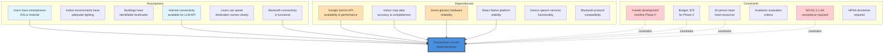

```mermaid
graph TB
    subgraph "Assumptions"
        A1[Users have smartphones<br/>iOS or Android]
        A2[Indoor environments have<br/>adequate lighting]
        A3[Buildings have<br/>identifiable landmarks]
        A4[Internet connectivity<br/>available for LLM API]
        A5[Users can speak<br/>destination names clearly]
        A6[Bluetooth connectivity<br/>is functional]
    end
    
    subgraph "Dependencies"
        D1[Google Gemini API<br/>availability & performance]
        D2[Indoor map data<br/>accuracy & completeness]
        D3[Smart glasses hardware<br/>reliability]
        D4[React Native platform<br/>stability]
        D5[Device speech services<br/>functionality]
        D6[Bluetooth protocol<br/>compatibility]
    end
    
    subgraph "Constraints"
        CON1[4-week development<br/>timeline Phase II]
        CON2[Budget: $75<br/>for Phase II]
        CON3[10-person team<br/>fixed resources]
        CON4[Academic evaluation<br/>criteria]
        CON5[WCAG 2.1 AA<br/>compliance required]
        CON6[HIPAA disclaimer<br/>required]
    end
    
    SYSTEM[Everywhere Locator<br/>Implementation]
    
    A1 --> SYSTEM
    A4 --> SYSTEM
    A6 --> SYSTEM
    
    D1 --> SYSTEM
    D2 --> SYSTEM
    D3 --> SYSTEM
    D4 --> SYSTEM
    
    CON1 -.constrains.-> SYSTEM
    CON2 -.constrains.-> SYSTEM
    CON3 -.constrains.-> SYSTEM
    CON5 -.constrains.-> SYSTEM
    
    style SYSTEM fill:#4A90E2,stroke:#333,stroke-width:3px
    style A1 fill:#E1F5FE
    style A4 fill:#E1F5FE
    style D1 fill:#FFE0B2
    style D3 fill:#FFE0B2
    style CON1 fill:#FFCDD2
    style CON5 fill:#FFCDD2
```