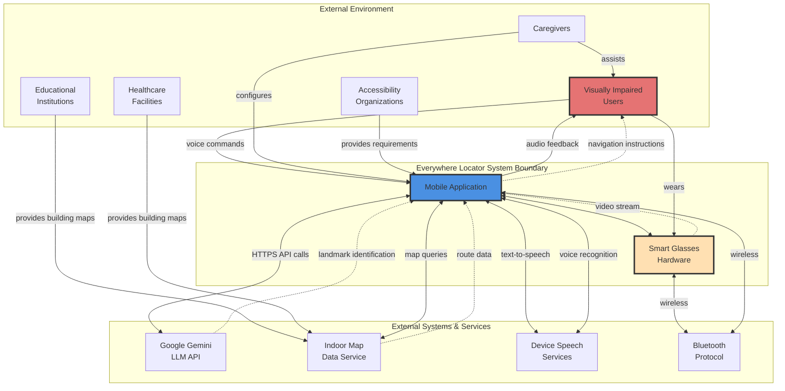

```mermaid
graph TB
    subgraph "External Environment"
        VI[Visually Impaired<br/>Users]
        CG[Caregivers]
        AO[Accessibility<br/>Organizations]
        EI[Educational<br/>Institutions]
        HF[Healthcare<br/>Facilities]
    end
    
    subgraph "Everywhere Locator System Boundary"
        APP[Mobile Application]
        GLASSES[Smart Glasses<br/>Hardware]
        
        APP <--> GLASSES
    end
    
    subgraph "External Systems & Services"
        LLM[Google Gemini<br/>LLM API]
        MAP[Indoor Map<br/>Data Service]
        SPEECH[Device Speech<br/>Services]
        BT[Bluetooth<br/>Protocol]
    end
    
    %% User Interactions
    VI -->|voice commands| APP
    VI -->|wears| GLASSES
    APP -->|audio feedback| VI
    
    CG -->|configures| APP
    CG -->|assists| VI
    
    AO -->|provides requirements| APP
    EI -->|provides building maps| MAP
    HF -->|provides building maps| MAP
    
    %% System Dependencies
    APP <-->|HTTPS API calls| LLM
    APP <-->|map queries| MAP
    APP <-->|text-to-speech| SPEECH
    APP <-->|voice recognition| SPEECH
    GLASSES <-->|wireless| BT
    APP <-->|wireless| BT
    
    %% Data Flows
    GLASSES -.video stream.-> APP
    APP -.navigation instructions.-> VI
    LLM -.landmark identification.-> APP
    MAP -.route data.-> APP
    
    style APP fill:#4A90E2,stroke:#333,stroke-width:3px
    style GLASSES fill:#FFE0B2,stroke:#333,stroke-width:3px
    style VI fill:#E57373,stroke:#333,stroke-width:3px
```
