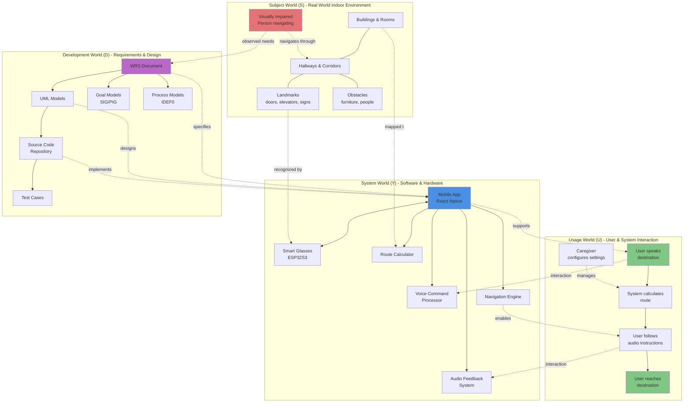

```mermaid
graph TB
    subgraph "Subject World (S) - Real World Indoor Environment"
        S1[Buildings & Rooms]
        S2[Hallways & Corridors]
        S3[Landmarks<br/>doors, elevators, signs]
        S4[Obstacles<br/>furniture, people]
        S5[Visually Impaired<br/>Person navigating]
        
        S1 --- S2
        S2 --- S3
        S2 --- S4
        S5 -.navigates through.-> S2
    end
    
    subgraph "Usage World (U) - User & System Interaction"
        U1[User speaks<br/>destination]
        U2[System calculates<br/>route]
        U3[User follows<br/>audio instructions]
        U4[User reaches<br/>destination]
        U5[Caregiver<br/>configures settings]
        
        U1 --> U2
        U2 --> U3
        U3 --> U4
        U5 -.manages.-> U2
    end
    
    subgraph "System World (Y) - Software & Hardware"
        Y1[Mobile App<br/>React Native]
        Y2[Smart Glasses<br/>ESP32S3]
        Y3[Voice Command<br/>Processor]
        Y4[Route Calculator]
        Y5[Navigation Engine]
        Y6[Audio Feedback<br/>System]
        
        Y1 <--> Y2
        Y1 --> Y3
        Y1 --> Y4
        Y1 --> Y5
        Y1 --> Y6
    end
    
    subgraph "Development World (D) - Requirements & Design"
        D1[WRS Document]
        D2[UML Models]
        D3[Goal Models<br/>SIG/PIG]
        D4[Process Models<br/>IDEF0]
        D5[Source Code<br/>Repository]
        D6[Test Cases]
        
        D1 --> D2
        D1 --> D3
        D1 --> D4
        D2 --> D5
        D5 --> D6
    end
    
    %% Relationships between worlds
    S5 -.observed needs.-> D1
    S1 -.mapped to.-> Y4
    S3 -.recognized by.-> Y2
    
    U1 -.interaction.-> Y3
    U3 -.interaction.-> Y6
    
    D1 -.specifies.-> Y1
    D2 -.designs.-> Y1
    D5 -.implements.-> Y1
    
    Y5 -.enables.-> U3
    Y1 -.supports.-> U1
    
    style S5 fill:#E57373
    style U1 fill:#81C784
    style U4 fill:#81C784
    style Y1 fill:#4A90E2
    style D1 fill:#BA68C8
```