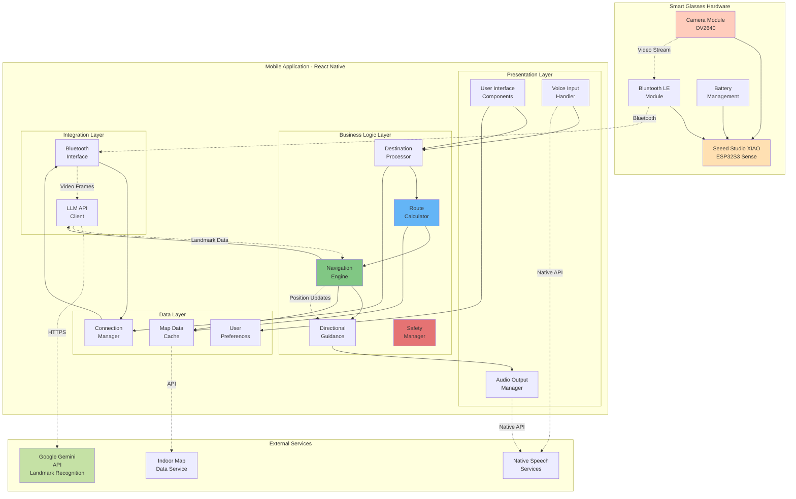

```mermaid
graph TB
    subgraph "Smart Glasses Hardware"
        SG[Seeed Studio XIAO<br/>ESP32S3 Sense]
        CAM[Camera Module<br/>OV2640]
        BLE[Bluetooth LE<br/>Module]
        BATT[Battery<br/>Management]
        
        CAM --> SG
        BLE --> SG
        BATT --> SG
    end
    
    subgraph "Mobile Application - React Native"
        subgraph "Presentation Layer"
            UI[User Interface<br/>Components]
            AUDIO[Audio Output<br/>Manager]
            VOICE[Voice Input<br/>Handler]
        end
        
        subgraph "Business Logic Layer"
            DEST[Destination<br/>Processor]
            ROUTE[Route<br/>Calculator]
            NAV[Navigation<br/>Engine]
            GUID[Directional<br/>Guidance]
            SAFETY[Safety<br/>Manager]
        end
        
        subgraph "Data Layer"
            CONN[Connection<br/>Manager]
            MAP[Map Data<br/>Cache]
            PREF[User<br/>Preferences]
        end
        
        subgraph "Integration Layer"
            BLE_INT[Bluetooth<br/>Interface]
            LLM_INT[LLM API<br/>Client]
        end
    end
    
    subgraph "External Services"
        GEMINI[Google Gemini<br/>API<br/>Landmark Recognition]
        SPEECH[Native Speech<br/>Services]
        MAPDATA[Indoor Map<br/>Data Service]
    end
    
    %% Connections - Hardware to App
    BLE -.Bluetooth.-> BLE_INT
    BLE_INT --> CONN
    
    %% Connections - Presentation to Logic
    UI --> DEST
    VOICE --> DEST
    DEST --> ROUTE
    ROUTE --> NAV
    NAV --> GUID
    GUID --> AUDIO
    
    %% Connections - Logic to Data
    ROUTE --> MAP
    NAV --> MAP
    UI --> PREF
    DEST --> CONN
    
    %% Connections - Integration
    CONN --> BLE_INT
    NAV --> LLM_INT
    
    %% External connections
    LLM_INT -.HTTPS.-> GEMINI
    VOICE -.Native API.-> SPEECH
    AUDIO -.Native API.-> SPEECH
    MAP -.API.-> MAPDATA
    
    %% Data flow
    CAM -.Video Stream.-> BLE
    BLE_INT -.Video Frames.-> LLM_INT
    LLM_INT -.Landmark Data.-> NAV
    NAV -.Position Updates.-> GUID
    
    style SG fill:#FFE0B2
    style CAM fill:#FFCCBC
    style GEMINI fill:#C5E1A5
    style NAV fill:#81C784
    style ROUTE fill:#64B5F6
    style SAFETY fill:#E57373
```