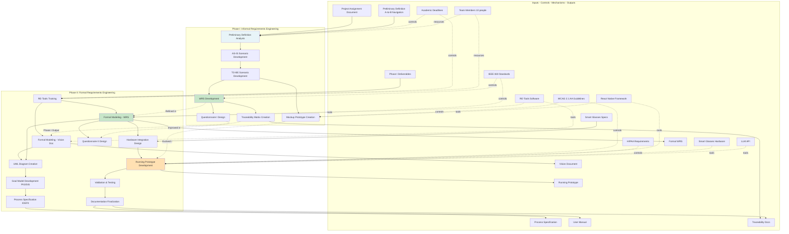

```mermaid
graph TB
    subgraph "Phase I: Informal Requirements Engineering"
        I1[Preliminary Definition Analysis]
        I2[AS-IS Scenario Development]
        I3[TO-BE Scenario Development]
        I4[Mockup Prototype Creation]
        I5[WRS Development]
        I6[Questionnaire I Design]
        I7[Traceability Matrix Creation]
        
        I1 --> I2
        I2 --> I3
        I3 --> I4
        I3 --> I5
        I5 --> I6
        I5 --> I7
        
        style I1 fill:#E8F4F8
        style I5 fill:#C8E6C9
    end
    
    subgraph "Phase II: Formal Requirements Engineering"
        II1[RE-Tools Training]
        II2[Formal Modeling - Vision Doc]
        II3[Formal Modeling - WRS]
        II4[UML Diagram Creation]
        II5[Goal Model Development PIG/SIG]
        II6[Process Specification IDEF0]
        II7[Hardware Integration Design]
        II8[Running Prototype Development]
        II9[Questionnaire II Design]
        II10[Validation & Testing]
        II11[Documentation Finalization]
        
        II1 --> II2
        II1 --> II3
        II2 --> II4
        II3 --> II4
        II4 --> II5
        II5 --> II6
        II3 --> II7
        II7 --> II8
        II3 --> II9
        II8 --> II10
        II10 --> II11
        
        style II3 fill:#C8E6C9
        style II8 fill:#FFE0B2
    end
    
    I7 -.Phase I Output.-> II2
    I5 -.Refined in.-> II3
    I4 -.Evolved to.-> II8
    I6 -.Improved in.-> II9
    
    subgraph "Inputs - Controls - Mechanisms - Outputs"
        IN1[Project Assignment Document]
        IN2[Preliminary Definition<br/>A-to-B Navigation]
        IN3[Phase I Deliverables]
        IN4[Smart Glasses Specs]
        
        C1[Academic Deadlines]
        C2[IEEE 830 Standards]
        C3[WCAG 2.1 AA Guidelines]
        C4[HIPAA Requirements]
        
        M1[Team Members 10 people]
        M2[RE-Tools Software]
        M3[React Native Framework]
        M4[Smart Glasses Hardware]
        M5[LLM API]
        
        OUT1[Vision Document]
        OUT2[Formal WRS]
        OUT3[Process Specification]
        OUT4[Running Prototype]
        OUT5[User Manual]
        OUT6[Traceability Docs]
    end
    
    IN1 --> I1
    IN2 --> I1
    IN3 --> II1
    IN4 --> II7
    
    C1 -.controls.-> I1
    C1 -.controls.-> II1
    C2 -.controls.-> I5
    C2 -.controls.-> II3
    C3 -.controls.-> I4
    C3 -.controls.-> II8
    C4 -.controls.-> II8
    
    M1 -.resources.-> I1
    M1 -.resources.-> II1
    M2 -.tools.-> II2
    M2 -.tools.-> II3
    M3 -.tools.-> I4
    M3 -.tools.-> II8
    M4 -.tools.-> II8
    M5 -.tools.-> II8
    
    I7 --> OUT6
    II2 --> OUT1
    II3 --> OUT2
    II6 --> OUT3
    II8 --> OUT4
    II11 --> OUT5
    II11 --> OUT6
```