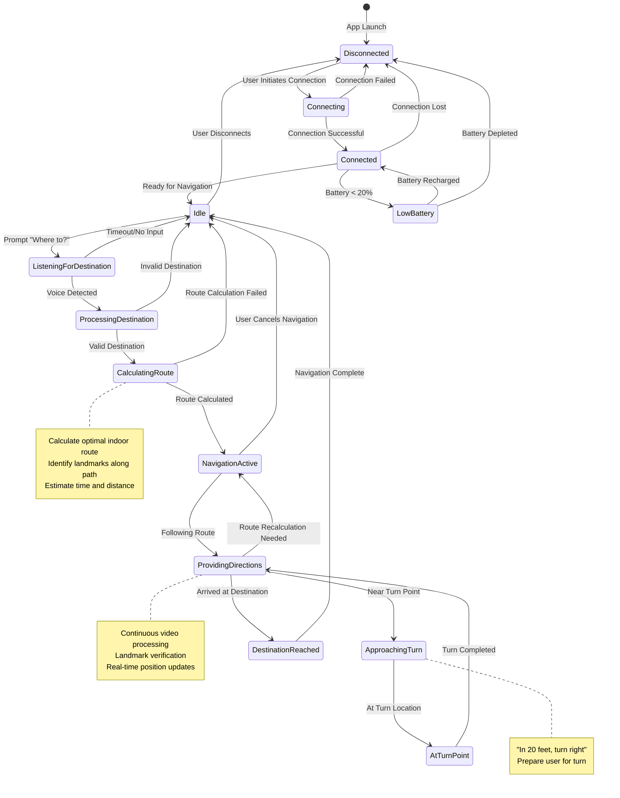

```mermaid
stateDiagram-v2
    [*] --> Disconnected: App Launch
    
    Disconnected --> Connecting: User Initiates Connection
    Connecting --> Connected: Connection Successful
    Connecting --> Disconnected: Connection Failed
    
    Connected --> Idle: Ready for Navigation
    Connected --> Disconnected: Connection Lost
    
    Idle --> ListeningForDestination: Prompt "Where to?"
    ListeningForDestination --> ProcessingDestination: Voice Detected
    ListeningForDestination --> Idle: Timeout/No Input
    
    ProcessingDestination --> CalculatingRoute: Valid Destination
    ProcessingDestination --> Idle: Invalid Destination
    
    CalculatingRoute --> NavigationActive: Route Calculated
    CalculatingRoute --> Idle: Route Calculation Failed
    
    NavigationActive --> ProvidingDirections: Following Route
    ProvidingDirections --> ApproachingTurn: Near Turn Point
    ApproachingTurn --> AtTurnPoint: At Turn Location
    AtTurnPoint --> ProvidingDirections: Turn Completed
    
    ProvidingDirections --> DestinationReached: Arrived at Destination
    DestinationReached --> Idle: Navigation Complete
    
    NavigationActive --> Idle: User Cancels Navigation
    ProvidingDirections --> NavigationActive: Route Recalculation Needed
    
    Connected --> LowBattery: Battery < 20%
    LowBattery --> Connected: Battery Recharged
    LowBattery --> Disconnected: Battery Depleted
    
    Idle --> Disconnected: User Disconnects
    
    note right of CalculatingRoute
        Calculate optimal indoor route
        Identify landmarks along path
        Estimate time and distance
    end note
    
    note right of ProvidingDirections
        Continuous video processing
        Landmark verification
        Real-time position updates
    end note
    
    note right of ApproachingTurn
        "In 20 feet, turn right"
        Prepare user for turn
    end note
```