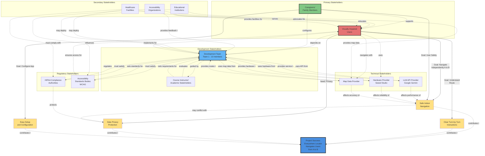

```mermaid
graph TB
    subgraph "Primary Stakeholders"
        VI[Visually Impaired<br/>Users]
        CG[Caregivers/<br/>Family Members]
    end
    
    subgraph "Secondary Stakeholders"
        AO[Accessibility<br/>Organizations]
        HF[Healthcare<br/>Facilities]
        EI[Educational<br/>Institutions]
    end
    
    subgraph "Development Stakeholders"
        DEV[Development Team<br/>Team 1 - 10 members]
        INST[Course Instructor/<br/>Academic Stakeholders]
    end
    
    subgraph "Technical Stakeholders"
        LLM[LLM API Provider<br/>Google Gemini]
        HW[Hardware Provider<br/>Seeed Studio]
        MAP[Map Data Provider]
    end
    
    subgraph "Regulatory Stakeholders"
        HIPAA[HIPAA Compliance<br/>Authorities]
        ACC[Accessibility<br/>Standards Bodies<br/>WCAG]
    end
    
    %% Primary Goals
    VI -->|Goal: Navigate<br/>Independently A to B| G1[Safe Indoor<br/>Navigation]
    VI -->|Goal: Understand<br/>Route| G2[Clear Turn-by-Turn<br/>Instructions]
    VI -->|Need: Privacy| G3[Data Privacy<br/>Protection]
    
    CG -->|Goal: User Safety| G1
    CG -->|Goal: Configure App| G4[Easy Setup<br/>and Configuration]
    
    %% Dependencies
    VI -.depends on.-> DEV
    VI -.uses.-> HW
    VI -.navigates with.-> MAP
    
    CG -.supports.-> VI
    CG -.configures.-> DEV
    
    DEV -.implements for.-> VI
    DEV -.guided by.-> INST
    DEV -.uses API from.-> LLM
    DEV -.uses hardware from.-> HW
    DEV -.uses map data from.-> MAP
    DEV -.must satisfy.-> HIPAA
    DEV -.must satisfy.-> ACC
    
    AO -.advocates for.-> VI
    AO -.provides feedback to.-> DEV
    AO -.influences.-> ACC
    
    HF -.serves.-> VI
    HF -.may deploy.-> DEV
    HF -.must comply with.-> HIPAA
    
    EI -.educates.-> VI
    EI -.may deploy.-> DEV
    EI -.provides facilities for.-> VI
    EI -.provides map data.-> MAP
    
    LLM -.provides service to.-> DEV
    LLM -.affects performance of.-> G1
    
    HW -.provides hardware to.-> DEV
    HW -.affects reliability of.-> G1
    
    MAP -.provides routes to.-> DEV
    MAP -.affects accuracy of.-> G1
    
    HIPAA -.regulates.-> DEV
    HIPAA -.protects.-> G3
    
    ACC -.sets standards for.-> DEV
    ACC -.ensures access for.-> VI
    
    INST -.evaluates.-> DEV
    INST -.sets requirements for.-> DEV
    
    %% Conflicts
    G1 -.may conflict with.-> G3
    
    %% Contributions
    G1 -.contributes to.-> Root[Project Success:<br/>Everywhere Locator<br/>Navigates Users<br/>from A to B]
    G2 -.contributes to.-> Root
    G3 -.contributes to.-> Root
    G4 -.contributes to.-> Root
    
    style VI fill:#E57373,stroke:#333,stroke-width:3px
    style CG fill:#81C784,stroke:#333,stroke-width:3px
    style DEV fill:#64B5F6,stroke:#333,stroke-width:3px
    style Root fill:#4A90E2,stroke:#333,stroke-width:4px
    style G1 fill:#FFE082
    style G2 fill:#FFE082
    style G3 fill:#FFE082
    style G4 fill:#FFE082
```