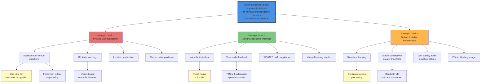

```mermaid
graph TB
    ROOT[Vision: Empower visually impaired individuals<br/>to navigate independently indoors<br/>from Point A to Point B]
    
    G1[Strategic Goal 1:<br/>Provide Safe Navigation]
    G2[Strategic Goal 2:<br/>Ensure Accessible Interface]
    G3[Strategic Goal 3:<br/>Deliver Reliable Performance]
    
    ROOT --> G1
    ROOT --> G2
    ROOT --> G3
    
    %% Strategic Goal 1 breakdown
    G1_1[Accurate turn-by-turn<br/>directions]
    G1_2[Obstacle warnings]
    G1_3[Location verification]
    G1_4[Conservative guidance]
    
    G1 --> G1_1
    G1 --> G1_2
    G1 --> G1_3
    G1 --> G1_4
    
    %% Strategic Goal 2 breakdown
    G2_1[Voice-first interface]
    G2_2[Clear audio feedback]
    G2_3[WCAG 2.1 AA compliance]
    G2_4[Minimal training needed]
    
    G2 --> G2_1
    G2 --> G2_2
    G2 --> G2_3
    G2 --> G2_4
    
    %% Strategic Goal 3 breakdown
    G3_1[Real-time tracking]
    G3_2[Stable connectivity<br/>greater than 95%]
    G3_3[Low latency audio<br/>less than 500ms]
    G3_4[Efficient battery usage]
    
    G3 --> G3_1
    G3 --> G3_2
    G3 --> G3_3
    G3 --> G3_4
    
    %% Operational Goals
    G1_1 --> OP1[Use LLM for<br/>landmark recognition]
    G1_1 --> OP2[Implement indoor<br/>map routing]
    G1_2 --> OP3[Vision-based<br/>obstacle detection]
    
    G2_1 --> OP4[React Native<br/>voice API]
    G2_2 --> OP5[TTS with adjustable<br/>speed & volume]
    
    G3_1 --> OP6[Continuous video<br/>processing]
    G3_2 --> OP7[Bluetooth LE<br/>with auto-reconnect]
    
    style ROOT fill:#4A90E2,stroke:#333,stroke-width:4px
    style G1 fill:#E57373
    style G2 fill:#81C784
    style G3 fill:#FFB74D
    style OP1 fill:#FFF9C4
    style OP4 fill:#FFF9C4
    style OP6 fill:#FFF9C4
```