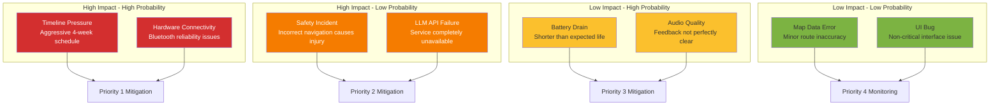

```mermaid
graph TB
    subgraph "High Impact - High Probability"
        HIHP1[Timeline Pressure<br/>Aggressive 4-week schedule]
        HIHP2[Hardware Connectivity<br/>Bluetooth reliability issues]
    end
    
    subgraph "High Impact - Low Probability"
        HILP1[Safety Incident<br/>Incorrect navigation causes injury]
        HILP2[LLM API Failure<br/>Service completely unavailable]
    end
    
    subgraph "Low Impact - High Probability"
        LIHP1[Battery Drain<br/>Shorter than expected life]
        LIHP2[Audio Quality<br/>Feedback not perfectly clear]
    end
    
    subgraph "Low Impact - Low Probability"
        LILP1[Map Data Error<br/>Minor route inaccuracy]
        LILP2[UI Bug<br/>Non-critical interface issue]
    end
    
    PRIORITY1[Priority 1 Mitigation]
    PRIORITY2[Priority 2 Mitigation]
    PRIORITY3[Priority 3 Mitigation]
    PRIORITY4[Priority 4 Monitoring]
    
    HIHP1 --> PRIORITY1
    HIHP2 --> PRIORITY1
    
    HILP1 --> PRIORITY2
    HILP2 --> PRIORITY2
    
    LIHP1 --> PRIORITY3
    LIHP2 --> PRIORITY3
    
    LILP1 --> PRIORITY4
    LILP2 --> PRIORITY4
    
    style HIHP1 fill:#D32F2F,color:#fff
    style HIHP2 fill:#D32F2F,color:#fff
    style HILP1 fill:#F57C00,color:#fff
    style HILP2 fill:#F57C00,color:#fff
    style LIHP1 fill:#FBC02D
    style LIHP2 fill:#FBC02D
    style LILP1 fill:#7CB342
    style LILP2 fill:#7CB342
```