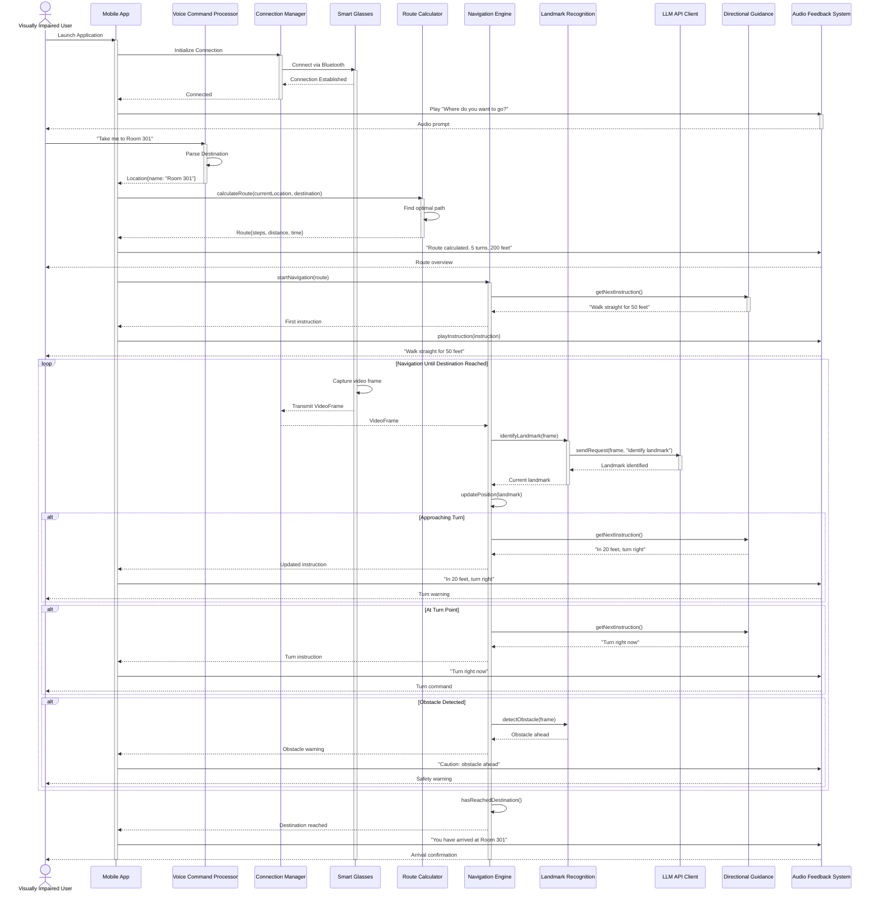

```mermaid
sequenceDiagram
    actor User as Visually Impaired User
    participant App as Mobile App
    participant Voice as Voice Command Processor
    participant Conn as Connection Manager
    participant Glasses as Smart Glasses
    participant Route as Route Calculator
    participant Nav as Navigation Engine
    participant Landmark as Landmark Recognition
    participant LLM as LLM API Client
    participant Guide as Directional Guidance
    participant Audio as Audio Feedback System
    
    User->>App: Launch Application
    activate App
    App->>Conn: Initialize Connection
    activate Conn
    Conn->>Glasses: Connect via Bluetooth
    activate Glasses
    Glasses-->>Conn: Connection Established
    Conn-->>App: Connected
    deactivate Conn
    
    App->>Audio: Play "Where do you want to go?"
    activate Audio
    Audio-->>User: Audio prompt
    deactivate Audio
    
    User->>Voice: "Take me to Room 301"
    activate Voice
    Voice->>Voice: Parse Destination
    Voice-->>App: Location{name: "Room 301"}
    deactivate Voice
    
    App->>Route: calculateRoute(currentLocation, destination)
    activate Route
    Route->>Route: Find optimal path
    Route-->>App: Route{steps, distance, time}
    deactivate Route
    
    App->>Audio: "Route calculated. 5 turns, 200 feet"
    Audio-->>User: Route overview
    
    App->>Nav: startNavigation(route)
    activate Nav
    Nav->>Guide: getNextInstruction()
    activate Guide
    Guide-->>Nav: "Walk straight for 50 feet"
    deactivate Guide
    
    Nav-->>App: First instruction
    App->>Audio: playInstruction(instruction)
    Audio-->>User: "Walk straight for 50 feet"
    
    loop Navigation Until Destination Reached
        Glasses->>Glasses: Capture video frame
        Glasses-->>Conn: Transmit VideoFrame
        Conn-->>Nav: VideoFrame
        
        Nav->>Landmark: identifyLandmark(frame)
        activate Landmark
        Landmark->>LLM: sendRequest(frame, "identify landmark")
        activate LLM
        LLM-->>Landmark: Landmark identified
        deactivate LLM
        Landmark-->>Nav: Current landmark
        deactivate Landmark
        
        Nav->>Nav: updatePosition(landmark)
        
        alt Approaching Turn
            Nav->>Guide: getNextInstruction()
            Guide-->>Nav: "In 20 feet, turn right"
            Nav-->>App: Updated instruction
            App->>Audio: "In 20 feet, turn right"
            Audio-->>User: Turn warning
        end
        
        alt At Turn Point
            Nav->>Guide: getNextInstruction()
            Guide-->>Nav: "Turn right now"
            Nav-->>App: Turn instruction
            App->>Audio: "Turn right now"
            Audio-->>User: Turn command
        end
        
        alt Obstacle Detected
            Nav->>Landmark: detectObstacle(frame)
            Landmark-->>Nav: Obstacle ahead
            Nav-->>App: Obstacle warning
            App->>Audio: "Caution: obstacle ahead"
            Audio-->>User: Safety warning
        end
    end
    
    Nav->>Nav: hasReachedDestination()
    Nav-->>App: Destination reached
    
    App->>Audio: "You have arrived at Room 301"
    Audio-->>User: Arrival confirmation
    
    deactivate Nav
    deactivate Glasses
    deactivate App
```