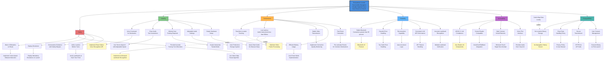

```mermaid
graph TB
    Root[Everywhere Locator<br/>Successfully Navigates<br/>Visually Impaired Users<br/>from Point A to Point B]
    
    Safety[Safety]
    Usability[Usability]
    Performance[Performance]
    Reliability[Reliability]
    Accessibility[Accessibility]
    Privacy[Privacy/HIPAA]
    
    Root --> Safety
    Root --> Usability
    Root --> Performance
    Root --> Reliability
    Root --> Accessibility
    Root --> Privacy
    
    %% Safety softgoals
    Safe1[Provide Accurate<br/>Turn-by-Turn Directions]
    Safe2[Warn of Obstacles<br/>on Route]
    Safe3[Display Disclaimer]
    Safe4[Conservative Guidance<br/>with Safety Margins]
    Safe5[Verify Location<br/>Before Turns]
    
    Safety --> Safe1
    Safety --> Safe2
    Safety --> Safe3
    Safety --> Safe4
    Safety --> Safe5
    
    %% Usability softgoals
    Use1[Voice Command<br/>for Destination]
    Use2[Clear Audio<br/>Turn Instructions]
    Use3[Minimal User<br/>Training Required]
    Use4[Adjustable Audio<br/>Settings]
    Use5[Simple Hardware<br/>Setup]
    
    Usability --> Use1
    Usability --> Use2
    Usability --> Use3
    Usability --> Use4
    Usability --> Use5
    
    %% Performance softgoals
    Perf1[Real-time Location<br/>Tracking]
    Perf2[Low Latency<br/>Audio Instructions less than 500ms]
    Perf3[Stable Video<br/>Transmission]
    Perf4[Efficient Battery<br/>Usage]
    Perf5[Fast Route<br/>Calculation]
    
    Performance --> Perf1
    Performance --> Perf2
    Performance --> Perf3
    Performance --> Perf4
    Performance --> Perf5
    
    %% Reliability softgoals
    Rel1[Stable Bluetooth<br/>Connection greater than 95 percent]
    Rel2[Graceful Error<br/>Handling]
    Rel3[Reconnection<br/>Capability]
    Rel4[Consistent LLM<br/>API Performance]
    Rel5[Accurate Landmark<br/>Recognition]
    
    Reliability --> Rel1
    Reliability --> Rel2
    Reliability --> Rel3
    Reliability --> Rel4
    Reliability --> Rel5
    
    %% Accessibility softgoals
    Acc1[WCAG 2.1 AA<br/>Compliance]
    Acc2[Screen Reader<br/>Compatible]
    Acc3[High Contrast<br/>Visual Elements]
    Acc4[Voice-First<br/>Interface]
    
    Accessibility --> Acc1
    Accessibility --> Acc2
    Accessibility --> Acc3
    Accessibility --> Acc4
    
    %% Privacy/HIPAA softgoals
    Priv1[No Location History<br/>Storage]
    Priv2[Clear Data<br/>Handling Policy]
    Priv3[Secure<br/>Transmission]
    Priv4[User Consent<br/>Management]
    
    Privacy --> Priv1
    Privacy --> Priv2
    Privacy --> Priv3
    Privacy --> Priv4
    
    %% Operationalizations
    Op1[Implement LLM-based<br/>Landmark Recognition]
    Op2[Use Indoor Map<br/>Route Algorithm]
    Op3[Implement Vision-based<br/>Obstacle Detection]
    Op4[Display Mandatory<br/>Disclaimer on Launch]
    Op5[Verify Landmarks at<br/>Each Turn Point]
    
    Safe1 --> Op1
    Safe1 --> Op2
    Safe2 --> Op3
    Safe3 --> Op4
    Safe5 --> Op5
    
    Op6[Implement React Native<br/>Voice Recognition API]
    Op7[Use Text-to-Speech<br/>with Adjustable Speed]
    Op8[Create Interactive<br/>Tutorial Mode]
    Op9[User Preference<br/>Storage System]
    Op10[Quick-Start Guide<br/>for Glasses Setup]
    
    Use1 --> Op6
    Use2 --> Op7
    Use3 --> Op8
    Use4 --> Op9
    Use5 --> Op10
    
    Op11[Optimize Video<br/>Frame Processing]
    Op12[Cache Map Data<br/>Locally]
    Op13[Implement Connection<br/>Quality Monitoring]
    Op14[Low-Power Mode<br/>Implementation]
    Op15[Pre-calculate Routes<br/>for Common Destinations]
    
    Perf1 --> Op11
    Perf2 --> Op11
    Perf3 --> Op13
    Perf4 --> Op14
    Perf5 --> Op15
    
    Op16[Bluetooth LE<br/>Protocol]
    Op17[Try-Catch Error<br/>Handling]
    Op18[Auto-reconnect<br/>Logic]
    Op19[API Timeout<br/>Handling]
    Op20[Multiple Landmark<br/>Verification]
    
    Rel1 --> Op16
    Rel2 --> Op17
    Rel3 --> Op18
    Rel4 --> Op19
    Rel5 --> Op20
    
    Op21[Use Shadcn UI<br/>Components]
    Op22[VoiceOver/TalkBack<br/>Integration]
    Op23[Minimum Touch<br/>Target Size 44x44pt]
    Op24[Prioritize Audio<br/>Over Visual UI]
    
    Acc1 --> Op21
    Acc2 --> Op22
    Acc3 --> Op23
    Acc4 --> Op24
    
    Op25[No Navigation History<br/>Stored]
    Op26[Privacy Policy<br/>in User Manual]
    Op27[HTTPS for<br/>API Calls]
    Op28[Consent Dialog<br/>on First Launch]
    
    Priv1 --> Op25
    Priv2 --> Op26
    Priv3 --> Op27
    Priv4 --> Op28
    
    %% Conflicts shown with dashed lines
    Perf1 -.conflict.-> Perf4
    Perf2 -.conflict.-> Safe1
    Op12 -.conflict.-> Priv1
    
    style Root fill:#4A90E2,stroke:#333,stroke-width:4px
    style Safety fill:#E57373
    style Usability fill:#81C784
    style Performance fill:#FFB74D
    style Reliability fill:#64B5F6
    style Accessibility fill:#BA68C8
    style Privacy fill:#4DB6AC
    
    style Op1 fill:#FFF9C4
    style Op6 fill:#FFF9C4
    style Op11 fill:#FFF9C4
    style Op16 fill:#FFF9C4
    style Op21 fill:#FFF9C4
    style Op25 fill:#FFF9C4
```