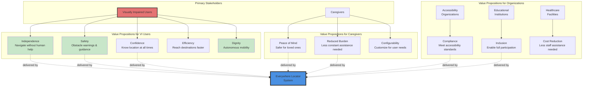

```mermaid
graph TB
    subgraph "Primary Stakeholders"
        VI[Visually Impaired Users]
        CG[Caregivers]
    end
    
    subgraph "Value Propositions for VI Users"
        V1[Independence<br/>Navigate without human help]
        V2[Safety<br/>Obstacle warnings & guidance]
        V3[Confidence<br/>Know location at all times]
        V4[Efficiency<br/>Reach destinations faster]
        V5[Dignity<br/>Autonomous mobility]
        
        VI --> V1
        VI --> V2
        VI --> V3
        VI --> V4
        VI --> V5
    end
    
    subgraph "Value Propositions for Caregivers"
        C1[Peace of Mind<br/>Safer for loved ones]
        C2[Reduced Burden<br/>Less constant assistance needed]
        C3[Configurability<br/>Customize for user needs]
        
        CG --> C1
        CG --> C2
        CG --> C3
    end
    
    subgraph "Value Propositions for Organizations"
        AO[Accessibility<br/>Organizations]
        EI[Educational<br/>Institutions]
        HF[Healthcare<br/>Facilities]
        
        O1[Compliance<br/>Meet accessibility standards]
        O2[Inclusion<br/>Enable full participation]
        O3[Cost Reduction<br/>Less staff assistance needed]
        
        AO --> O1
        EI --> O2
        HF --> O3
    end
    
    SYSTEM[Everywhere Locator<br/>System]
    
    V1 -.delivered by.-> SYSTEM
    V2 -.delivered by.-> SYSTEM
    V3 -.delivered by.-> SYSTEM
    C1 -.delivered by.-> SYSTEM
    C2 -.delivered by.-> SYSTEM
    O1 -.delivered by.-> SYSTEM
    O2 -.delivered by.-> SYSTEM
    
    style SYSTEM fill:#4A90E2,stroke:#333,stroke-width:4px
    style VI fill:#E57373,stroke:#333,stroke-width:3px
    style V1 fill:#C8E6C9
    style V2 fill:#C8E6C9
    style V5 fill:#C8E6C9
```