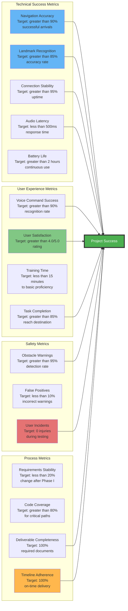

```mermaid
graph LR
    subgraph "Technical Success Metrics"
        T1[Navigation Accuracy<br/>Target: greater than 90%<br/>successful arrivals]
        T2[Landmark Recognition<br/>Target: greater than 85%<br/>accuracy rate]
        T3[Connection Stability<br/>Target: greater than 95%<br/>uptime]
        T4[Audio Latency<br/>Target: less than 500ms<br/>response time]
        T5[Battery Life<br/>Target: greater than 2 hours<br/>continuous use]
    end
    
    subgraph "User Experience Metrics"
        U1[Voice Command Success<br/>Target: greater than 90%<br/>recognition rate]
        U2[User Satisfaction<br/>Target: greater than 4.0/5.0<br/>rating]
        U3[Training Time<br/>Target: less than 15 minutes<br/>to basic proficiency]
        U4[Task Completion<br/>Target: greater than 85%<br/>reach destination]
    end
    
    subgraph "Safety Metrics"
        S1[Obstacle Warnings<br/>Target: greater than 95%<br/>detection rate]
        S2[False Positives<br/>Target: less than 10%<br/>incorrect warnings]
        S3[User Incidents<br/>Target: 0 injuries<br/>during testing]
    end
    
    subgraph "Process Metrics"
        P1[Requirements Stability<br/>Target: less than 20%<br/>change after Phase I]
        P2[Code Coverage<br/>Target: greater than 80%<br/>for critical paths]
        P3[Deliverable Completeness<br/>Target: 100%<br/>required documents]
        P4[Timeline Adherence<br/>Target: 100%<br/>on-time delivery]
    end
    
    SUCCESS[Project Success]
    
    T1 --> SUCCESS
    T2 --> SUCCESS
    T3 --> SUCCESS
    T4 --> SUCCESS
    
    U1 --> SUCCESS
    U2 --> SUCCESS
    U4 --> SUCCESS
    
    S1 --> SUCCESS
    S3 --> SUCCESS
    
    P3 --> SUCCESS
    P4 --> SUCCESS
    
    style SUCCESS fill:#4CAF50,stroke:#333,stroke-width:4px,color:#fff
    style T1 fill:#64B5F6
    style T2 fill:#64B5F6
    style U2 fill:#81C784
    style S3 fill:#E57373
    style P4 fill:#FFB74D
```