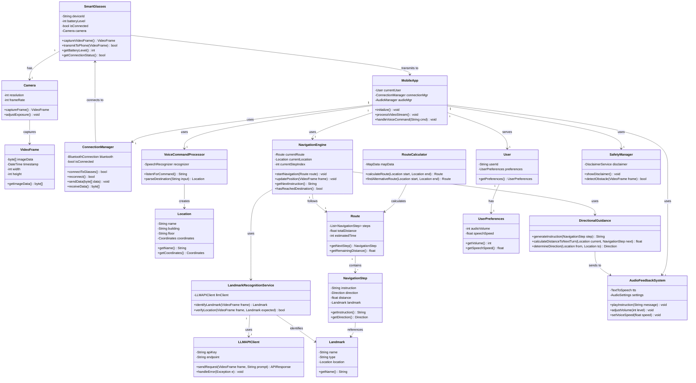

```mermaid
classDiagram
    class SmartGlasses {
        -String deviceId
        -int batteryLevel
        -bool isConnected
        -Camera camera
        +captureVideoFrame() VideoFrame
        +transmitToPhone(VideoFrame) bool
        +getBatteryLevel() int
        +getConnectionStatus() bool
    }

    class Camera {
        -int resolution
        -int frameRate
        +captureFrame() VideoFrame
        +adjustExposure() void
    }

    class VideoFrame {
        -byte[] imageData
        -DateTime timestamp
        -int width
        -int height
        +getImageData() byte[]
    }

    class MobileApp {
        -User currentUser
        -ConnectionManager connectionMgr
        -AudioManager audioMgr
        +initialize() void
        +processVideoStream() void
        +handleVoiceCommand(String cmd) void
    }

    class ConnectionManager {
        -BluetoothConnection bluetooth
        -bool isConnected
        +connectToGlasses() bool
        +reconnect() bool
        +sendData(byte[] data) void
        +receiveData() byte[]
    }

    class VoiceCommandProcessor {
        -SpeechRecognizer recognizer
        +listenForCommand() String
        +parseDestination(String input) Location
    }

    class Location {
        -String name
        -String building
        -String floor
        -Coordinates coordinates
        +getName() String
        +getCoordinates() Coordinates
    }

    class RouteCalculator {
        -MapData mapData
        +calculateRoute(Location start, Location end) Route
        +findAlternativeRoute(Location start, Location end) Route
    }

    class Route {
        -List~NavigationStep~ steps
        -float totalDistance
        -int estimatedTime
        +getNextStep() NavigationStep
        +getRemainingDistance() float
    }

    class NavigationStep {
        -String instruction
        -Direction direction
        -float distance
        -Landmark landmark
        +getInstruction() String
        +getDirection() Direction
    }

    class LandmarkRecognitionService {
        -LLMAPIClient llmClient
        +identifyLandmark(VideoFrame frame) Landmark
        +verifyLocation(VideoFrame frame, Landmark expected) bool
    }

    class Landmark {
        -String name
        -String type
        -Location location
        +getName() String
    }

    class LLMAPIClient {
        -String apiKey
        -String endpoint
        +sendRequest(VideoFrame frame, String prompt) APIResponse
        +handleError(Exception e) void
    }

    class NavigationEngine {
        -Route currentRoute
        -Location currentLocation
        -int currentStepIndex
        +startNavigation(Route route) void
        +updatePosition(VideoFrame frame) void
        +getNextInstruction() String
        +hasReachedDestination() bool
    }

    class DirectionalGuidance {
        +generateInstruction(NavigationStep step) String
        +calculateDistanceToNextTurn(Location current, NavigationStep next) float
        +determineDirection(Location from, Location to) Direction
    }

    class AudioFeedbackSystem {
        -TextToSpeech tts
        -AudioSettings settings
        +playInstruction(String message) void
        +adjustVolume(int level) void
        +setVoiceSpeed(float speed) void
    }

    class User {
        -String userId
        -UserPreferences preferences
        +getPreferences() UserPreferences
    }

    class UserPreferences {
        -int audioVolume
        -float speechSpeed
        +getVolume() int
        +getSpeechSpeed() float
    }

    class SafetyManager {
        -DisclaimerService disclaimer
        +showDisclaimer() void
        +detectObstacle(VideoFrame frame) bool
    }

    %% Relationships
    SmartGlasses "1" --> "1" Camera : has
    Camera --> VideoFrame : captures
    SmartGlasses --> MobileApp : transmits to
    
    MobileApp "1" --> "1" ConnectionManager : uses
    MobileApp "1" --> "1" VoiceCommandProcessor : uses
    MobileApp "1" --> "1" NavigationEngine : uses
    MobileApp "1" --> "1" AudioFeedbackSystem : uses
    MobileApp "1" --> "1" SafetyManager : uses
    MobileApp "1" --> "1" User : serves
    
    VoiceCommandProcessor --> Location : creates
    
    RouteCalculator --> Route : calculates
    Route "1" --> "*" NavigationStep : contains
    NavigationStep --> Landmark : references
    
    NavigationEngine "1" --> "1" Route : follows
    NavigationEngine --> LandmarkRecognitionService : uses
    NavigationEngine --> DirectionalGuidance : uses
    
    LandmarkRecognitionService "1" --> "1" LLMAPIClient : uses
    LandmarkRecognitionService --> Landmark : identifies
    
    DirectionalGuidance --> AudioFeedbackSystem : sends to
    
    User "1" --> "1" UserPreferences : has
    
    ConnectionManager --> SmartGlasses : connects to
```