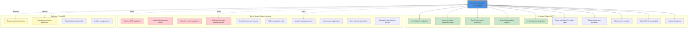

```mermaid
graph TB
    subgraph "In Scope - Phase II MVP"
        IN1[A-to-B indoor navigation]
        IN2[Voice command destination input]
        IN3[Turn-by-turn audio directions]
        IN4[Smart glasses video capture]
        IN5[LLM landmark recognition]
        IN6[Route calculation for indoor maps]
        IN7[Obstacle detection warnings]
        IN8[Bluetooth connectivity]
        IN9[WCAG 2.1 AA accessibility]
        IN10[Safety disclaimers]
        
        style IN1 fill:#C8E6C9
        style IN2 fill:#C8E6C9
        style IN3 fill:#C8E6C9
        style IN4 fill:#C8E6C9
        style IN5 fill:#C8E6C9
    end
    
    subgraph "Out of Scope - Future Versions"
        OUT1[Outdoor GPS navigation]
        OUT2[Multi-building campus routes]
        OUT3[Elevator control integration]
        OUT4[Fall detection with emergency calls]
        OUT5[Social features user sharing]
        OUT6[Offline navigation mode]
        OUT7[Multiple language support]
        OUT8[Habit-based suggestions]
        OUT9[Door opening automation]
        OUT10[Integration with building security]
        
        style OUT1 fill:#FFCDD2
        style OUT2 fill:#FFCDD2
        style OUT3 fill:#FFCDD2
        style OUT4 fill:#FFCDD2
    end
    
    subgraph "Deferred - Post-MVP"
        DEF1[Route preference learning]
        DEF2[Caregiver monitoring dashboard]
        DEF3[Customizable audio profiles]
        DEF4[Multiple map providers]
        
        style DEF1 fill:#FFF9C4
        style DEF2 fill:#FFF9C4
    end
    
    CORE[Everywhere Locator<br/>Core System]
    
    CORE --> IN1
    CORE --> IN2
    CORE --> IN3
    CORE --> IN4
    CORE --> IN5
    CORE --> IN6
    CORE --> IN7
    CORE --> IN8
    CORE --> IN9
    CORE --> IN10
    
    CORE -.future.-> OUT1
    CORE -.future.-> OUT4
    CORE -.future.-> OUT7
    
    CORE -.deferred.-> DEF1
    CORE -.deferred.-> DEF2
    
    style CORE fill:#4A90E2,stroke:#333,stroke-width:4px
```