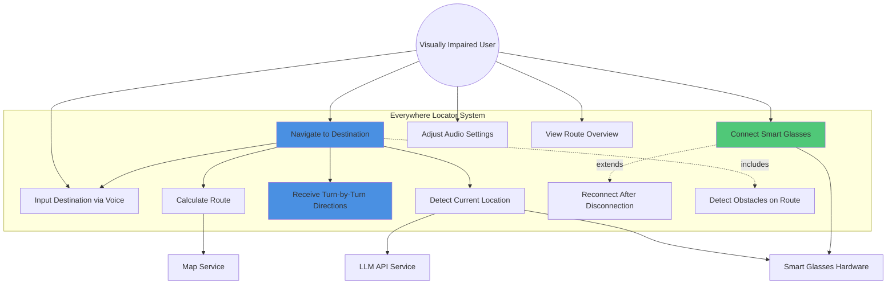

```mermaid
graph TB
    subgraph "Everywhere Locator System"
        UC1[Navigate to Destination]
        UC2[Input Destination via Voice]
        UC3[Calculate Route]
        UC4[Receive Turn-by-Turn Directions]
        UC5[Detect Current Location]
        UC6[Connect Smart Glasses]
        UC7[Adjust Audio Settings]
        UC8[View Route Overview]
        UC9[Reconnect After Disconnection]
        UC10[Detect Obstacles on Route]
    end
    
    User((Visually Impaired User))
    MapService[Map Service]
    LLM[LLM API Service]
    Glasses[Smart Glasses Hardware]
    
    User --> UC1
    User --> UC2
    User --> UC6
    User --> UC7
    User --> UC8
    
    UC1 --> UC2
    UC1 --> UC3
    UC1 --> UC4
    UC1 --> UC5
    
    UC3 --> MapService
    UC5 --> LLM
    UC5 --> Glasses
    
    UC6 --> Glasses
    UC6 -.extends.-> UC9
    
    UC1 -.includes.-> UC10
    
    style UC1 fill:#4A90E2
    style UC4 fill:#4A90E2
    style UC6 fill:#50C878
```