# Vision Document - Everywhere Locator

**Version:** 2.0  
**Date:** November 4, 2025  
**Project:** Everywhere Locator - A-to-B Indoor Navigation for Visually Impaired Users  
**Team URL:** https://everywhere-locator.vercel.app

---

## Table of Contents

1. [Executive Summary](#executive-summary)
2. [Problem Statement](#problem-statement)
3. [Vision Statement](#vision-statement)
4. [Scope Definition](#scope-definition)
5. [Stakeholder Analysis](#stakeholder-analysis)
6. [Goals & Objectives](#goals--objectives)
7. [Success Criteria](#success-criteria)
8. [Key Features](#key-features)
9. [Constraints & Assumptions](#constraints--assumptions)
10. [Context & Environment](#context--environment)
11. [Revision History](#revision-history)

---

## Executive Summary

Everywhere Locator is a mobile application designed to empower visually impaired individuals with **independent indoor navigation** from Point A to Point B. 

**Phase II Innovation:** Integration of smart glasses hardware (Seeed Studio XIAO ESP32S3 Sense) that captures video footage and transmits it to the smartphone for real-time processing. This enables accurate landmark recognition, position verification, and reliable turn-by-turn audio directions.

**Target Users:** Visually impaired individuals navigating complex indoor environments (office buildings, universities, hospitals, transit hubs).

**Key Differentiator:** Voice-first interface combined with smart glasses vision for safe, accurate, independent navigation.

---

## Problem Statement

### Current Situation

Visually impaired individuals face significant challenges when navigating unfamiliar indoor environments:

```mermaid
graph TB
    subgraph "Challenges Faced by Visually Impaired Users"
        C1["Cannot locate Point B<br/>from Point A independently"]
        C2["Risk of getting lost<br/>or disoriented"]
        C3["Limited confidence in<br/>new environments"]
        C4["Depend on human guides<br/>or mobility devices only"]
        C5["Cannot verify position<br/>at decision points"]
        C6["No real-time obstacle<br/>awareness while navigating"]
    end
    
    subgraph "Current Solutions"
        S1["White cane<br/>obstacle avoidance only"]
        S2["Guide dog<br/>obstacle avoidance only"]
        S3["Human guide<br/>assistance dependent"]
        S4["GPS/Maps<br/>unreliable indoors"]
    end
    
    subgraph "Limitations"
        L1["Limited to outdoor use<br/>or pre-planned routes"]
        L2["No real-time landmark<br/>recognition"]
        L3["Cannot calculate routes<br/>autonomously"]
        L4["Cannot provide turn-by-turn<br/>guidance"]
        L5["No position verification"]
    end
    
    C1 --> L1
    C2 --> L2
    C3 --> L3
    C4 --> L4
    C5 --> L5
    C6 --> L2
    
    S1 -.limitations.-> L1
    S2 -.limitations.-> L2
    S3 -.limitations.-> L3
    S4 -.limitations.-> L4
    
    style C1 fill:#FFCDD2
    style C4 fill:#FFCDD2
    style S1 fill:#E8F5E9
    style L1 fill:#FFF9C4
```

### Root Causes

| Challenge | Root Cause | Impact |
|-----------|-----------|--------|
| **Loss of independence** | Requires human assistance for navigation | Reduced autonomy and dignity |
| **Navigation errors** | No real-time position verification | Safety risks |
| **Time consumption** | Manual route planning required | Inefficiency |
| **Lack of confidence** | Uncertainty about location | Hesitation to explore |
| **Limited accessibility** | Existing solutions focus only on obstacles | Incomplete assistance |

### Scope of Problem

- **Who:** Visually impaired individuals (blind or severely low-vision)
- **Where:** Complex indoor environments (multi-floor buildings, campuses, hospitals, transit hubs)
- **When:** During daily navigation tasks (work, education, healthcare, shopping)
- **Why:** Need to reach specific destinations independently
- **What's Missing:** Real-time A-to-B navigation guidance with landmark verification

---

## Vision Statement

```
To empower visually impaired individuals with the independence, 
confidence, and capability to navigate complex indoor environments 
autonomously, from any Point A to any Point B, using intelligent 
mobile technology that combines voice commands, real-time landmark 
recognition, and turn-by-turn audio guidance.
```

### Vision Elaboration

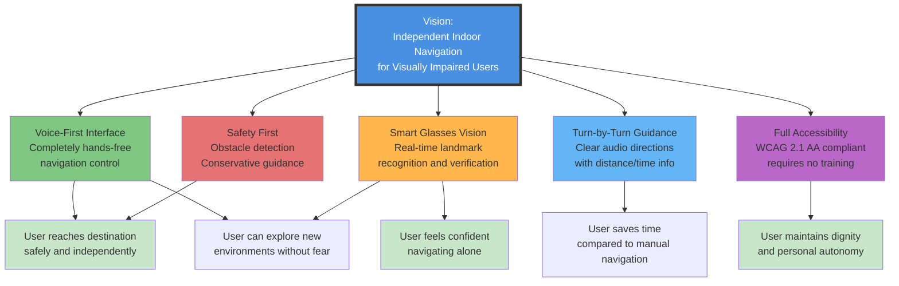

---

## Scope Definition

### In Scope - Phase II MVP

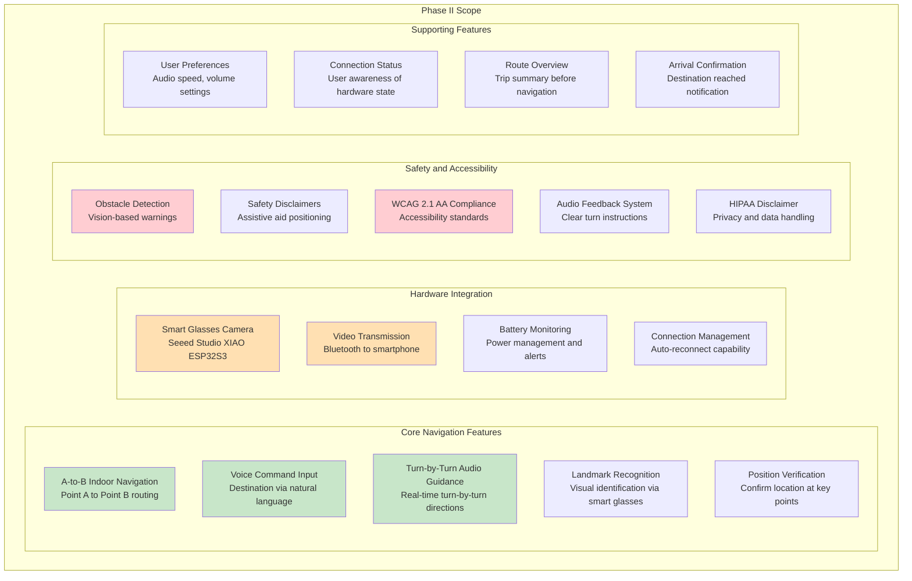

### Out of Scope - Future Versions

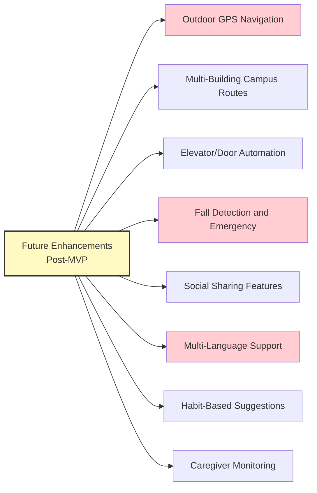

### Deferred to Phase II.1 or Later

- Advanced machine learning for route optimization
- Integration with building management systems
- Social features (group navigation, community maps)
- Offline operation without internet connectivity
- Multiple map provider support

---

## Stakeholder Analysis

### Stakeholder Map

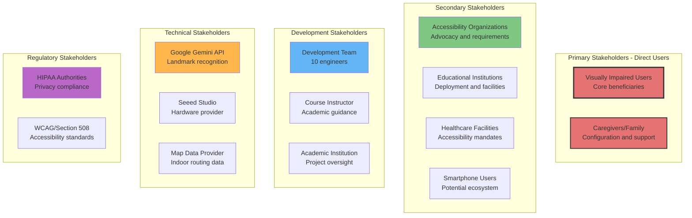

### For/Of/By Analysis

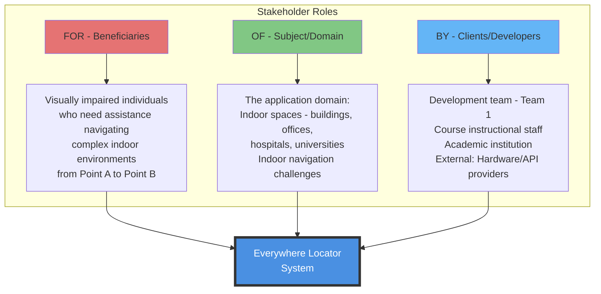

---

## Goals & Objectives

### Strategic Goals - Phase II

```mermaid
graph TB
    VISION["Vision: Independent<br/>Indoor A-to-B Navigation"]
    
    G1["Strategic Goal 1:<br/>Safe Navigation"]
    G2["Strategic Goal 2:<br/>Accessible Interface"]
    G3["Strategic Goal 3:<br/>Reliable Performance"]
    G4["Strategic Goal 4:<br/>User Confidence"]
    
    VISION --> G1
    VISION --> G2
    VISION --> G3
    VISION --> G4
    
    %% Goal 1 Breakdown
    G1_1["Accurate turn-by-turn<br/>directions"]
    G1_2["Obstacle detection<br/>and warnings"]
    G1_3["Position verification<br/>at decision points"]
    G1_4["Conservative guidance<br/>with safety margins"]
    
    G1 --> G1_1
    G1 --> G1_2
    G1 --> G1_3
    G1 --> G1_4
    
    %% Goal 2 Breakdown
    G2_1["Voice-first interface<br/>no visual dependency"]
    G2_2["Clear audio feedback<br/>easy to understand"]
    G2_3["WCAG 2.1 AA compliance<br/>accessibility standards"]
    G2_4["Minimal training required<br/>intuitive use"]
    
    G2 --> G2_1
    G2 --> G2_2
    G2 --> G2_3
    G2 --> G2_4
    
    %% Goal 3 Breakdown
    G3_1["Real-time location<br/>tracking accuracy"]
    G3_2["Stable connectivity<br/>greater than 95 percent"]
    G3_3["Low latency audio<br/>less than 500ms"]
    G3_4["Efficient battery usage<br/>2 plus hours per session"]
    
    G3 --> G3_1
    G3 --> G3_2
    G3 --> G3_3
    G3 --> G3_4
    
    %% Goal 4 Breakdown
    G4_1["User feels safe<br/>and secure"]
    G4_2["User feels empowered<br/>to navigate independently"]
    G4_3["User wants to use<br/>the system again"]
    G4_4["User trusts the system<br/>for future navigation"]
    
    G4 --> G4_1
    G4 --> G4_2
    G4 --> G4_3
    G4 --> G4_4
    
    style VISION fill:#4A90E2,stroke:#333,stroke-width:4px,color:#fff
    style G1 fill:#E57373,stroke:#333,stroke-width:2px
    style G2 fill:#81C784,stroke:#333,stroke-width:2px
    style G3 fill:#FFB74D,stroke:#333,stroke-width:2px
    style G4 fill:#64B5F6,stroke:#333,stroke-width:2px
```

### Measurable Objectives

| Goal | Objective | Success Metric | Target |
|------|-----------|-----------------|--------|
| **Safe Navigation** | Users reach destination without incident | Navigation completion rate | >90% |
| **Safe Navigation** | Accurate position during navigation | Landmark recognition accuracy | >85% |
| **Safe Navigation** | Warn of obstacles ahead | Obstacle detection rate | >95% |
| **Accessible Interface** | User can input destination | Voice recognition success rate | >90% |
| **Accessible Interface** | User understands directions | Turn-by-turn clarity rating | 4.0+/5.0 |
| **Reliable Performance** | System responds quickly | Audio latency | <500ms |
| **Reliable Performance** | Stable connection | Bluetooth uptime | >95% |
| **Reliable Performance** | Sustained usage | Battery life per session | 2+ hours |
| **User Confidence** | User satisfaction | Satisfaction rating | 4.0+/5.0 |
| **User Confidence** | Willing to use independently | Repeat usage rate | >70% |

---

## Success Criteria

### Phase II Completion Criteria

```mermaid
graph TB
    subgraph "Functional Success"
        F1["Prototype navigates user<br/>from Point A to Point B"]
        F2["Voice command accepts<br/>any building location"]
        F3["Turn-by-turn guidance<br/>is clear and actionable"]
        F4["Landmarks recognized<br/>accurately from video"]
        F5["Obstacles detected<br/>and communicated"]
        F6["Smart glasses connected<br/>reliably to phone"]
    end
    
    subgraph "Technical Success"
        T1["Navigation accuracy greater than 90 percent<br/>reach correct destination"]
        T2["Landmark recognition greater than 85 percent<br/>identify landmarks correctly"]
        T3["Connection stability greater than 95 percent<br/>maintain Bluetooth link"]
        T4["Audio latency less than 500ms<br/>timely direction delivery"]
        T5["Battery life 2 plus hours<br/>complete typical route"]
    end
    
    subgraph "Documentation Success"
        D1["Vision Document complete<br/>using RE-Tools"]
        D2["WRS with formal models<br/>UML, PIG, SIG diagrams"]
        D3["Process Specification<br/>IDEF0 documented"]
        D4["User Manual provided<br/>clear setup and instructions"]
        D5["Traceability matrix<br/>Phase I to Phase II"]
    end
    
    subgraph "User Validation Success"
        U1["Questionnaire II shows<br/>positive feedback greater than 4.0/5.0"]
        U2["Users rate system<br/>easy to use"]
        U3["Users feel safe<br/>during navigation"]
        U4["Users want to use<br/>system again"]
    end
    
    subgraph "Safety and Compliance"
        S1["No user incidents<br/>during testing"]
        S2["Safety disclaimer<br/>clearly displayed"]
        S3["WCAG 2.1 AA compliant<br/>accessibility verified"]
        S4["HIPAA statement<br/>privacy addressed"]
    end
    
    ROOT[["Phase II Success"]]
    
    F1 --> ROOT
    F3 --> ROOT
    T1 --> ROOT
    T3 --> ROOT
    D1 --> ROOT
    D5 --> ROOT
    U2 --> ROOT
    S1 --> ROOT
    S3 --> ROOT
    
    style ROOT fill:#4CAF50,stroke:#333,stroke-width:4px,color:#fff
    style F1 fill:#C8E6C9
    style T1 fill:#BBDEFB
    style D1 fill:#F8BBD0
    style U2 fill:#E1BEE7
    style S1 fill:#C8E6C9
```

---

## Key Features

### Feature Overview

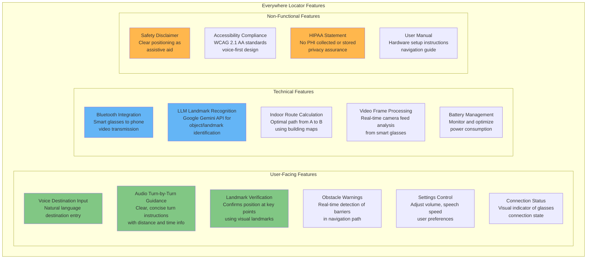

### Use Case Overview

```mermaid
graph TB
    USER[["Visually Impaired User"]]
    CG[["Caregiver"]]
    
    subgraph "Primary Use Cases"
        UC1["Navigate to Destination<br/>User specifies point B,<br/>system guides to arrival"]
        UC2["Listen to Route Summary<br/>Confirm planned route<br/>before starting"]
        UC3["Verify Current Position<br/>System confirms location<br/>using landmarks"]
        UC4["Receive Obstacle Warning<br/>Alerted to barriers<br/>on the route"]
    end
    
    subgraph "Support Use Cases"
        UC5["Configure Settings<br/>Adjust audio preferences"]
        UC6["Connect Smart Glasses<br/>Pair device on first use"]
        UC7["Check Connection Status<br/>Verify hardware ready"]
    end
    
    subgraph "Caregiver Use Cases"
        UC8["Configure for User<br/>Set up app settings"]
        UC9["Monitor Battery<br/>Check glasses battery level"]
    end
    
    USER --> UC1
    USER --> UC2
    USER --> UC3
    USER --> UC4
    USER --> UC5
    USER --> UC6
    USER --> UC7
    
    CG --> UC8
    CG --> UC9
    
    style UC1 fill:#C8E6C9,stroke:#333,stroke-width:2px
    style UC2 fill:#C8E6C9
    style USER fill:#E57373,stroke:#333,stroke-width:3px
    style CG fill:#64B5F6,stroke:#333,stroke-width:2px
```

---

## Constraints & Assumptions

### Constraints

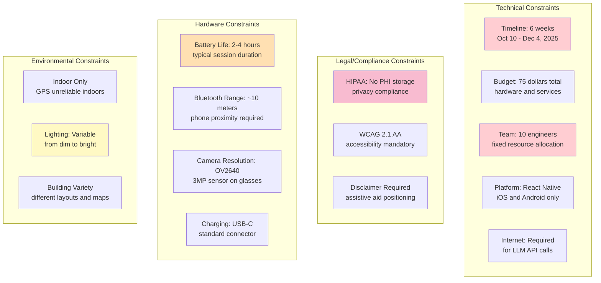

### Assumptions

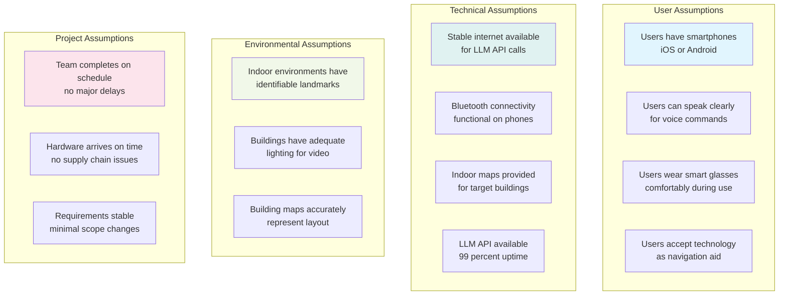

---

## Context & Environment

### System Context

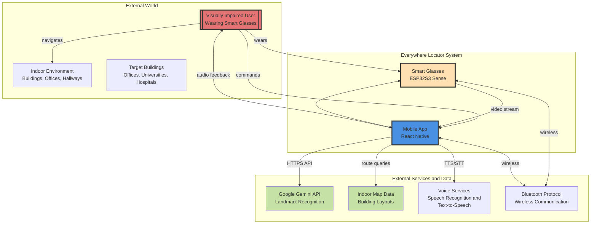

### Environmental Constraints

| Factor | Current State | Impact | Mitigation |
|--------|--------------|--------|-----------|
| **Indoor Lighting** | Highly variable (dim to bright) | Video quality impacts landmark recognition | Implement adaptive exposure and contrast enhancement |
| **Building Layouts** | Diverse and complex | Different route complexities | Use building-specific maps; test in multiple buildings |
| **Internet Connectivity** | Varies by location | LLM API calls may fail | Implement offline fallback; retry logic |
| **User Mobility** | Varies (walking speeds, abilities) | Navigation pace must adapt | Allow adjustable audio speed; distance estimates |
| **Noise Levels** | Variable indoors | Voice recognition challenges | Test in noisy environments; implement noise filtering |

---

## Revision History

| Version | Date | Author | Changes |
|---------|------|--------|---------|
| 1.0 | Oct 9, 2025 | Duy Pham (ldp210003) | Initial vision from Phase I |
| 2.0 | Nov 4, 2025 | Duy Pham (ldp210003) | Phase II: Added smart glasses hardware context, formal structure for RE-Tools, detailed stakeholder analysis, comprehensive goals and objectives, success criteria, key features overview. **Clarified: A-to-B navigation maintained from Phase I; only hardware input changed.** |

---

## Appendix A: Vision-Goals Alignment Matrix

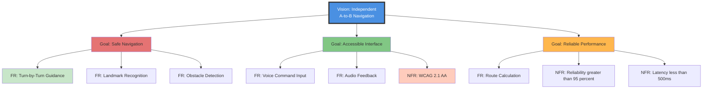

---

## Appendix B: Stakeholder Needs Summary

### Visually Impaired Users

- **Need:** Navigate independently from Point A to Point B without human assistance
- **Value:** Independence, dignity, confidence
- **Pain Points:** Getting lost, safety concerns, dependency on guides
- **Success:** Reach destination safely using only audio guidance

### Caregivers

- **Need:** Configure system for user; monitor safety
- **Value:** Peace of mind; reduced burden
- **Pain Points:** User frustration; constant assistance needed
- **Success:** User navigates independently with system support

### Accessibility Organizations

- **Need:** Compliance with accessibility standards
- **Value:** Advocacy for disabled population; inclusive technology
- **Pain Points:** Limited accessible solutions; high cost of existing aids
- **Success:** Accessible solution that works; advocacy potential

### Educational Institutions

- **Need:** Enable visually impaired students to navigate campus
- **Value:** Inclusion; compliance with accessibility laws
- **Pain Points:** Accommodations cost; limited solutions
- **Success:** Students navigate campus independently

### Development Team

- **Need:** Deliver functional system on time within budget
- **Value:** Project success; technical learning; professional growth
- **Pain Points:** Aggressive timeline; complex requirements; hardware integration
- **Success:** Complete, working prototype with all deliverables

---

## Appendix C: Success Story - User Journey

```
Morning: Sarah - Visually Impaired User

"Good morning, Everywhere Locator. Take me to Meeting Room 301."

System: "Route calculated. 5 turns, 220 feet, about 3 minutes."

Sarah starts walking, wearing her smart glasses connected to her phone.

System: "Walk straight ahead for 50 feet. Conference room doors on your right."

Sarah confidently walks down the hallway.

System: "Approaching first turn. In 20 feet, turn right at the water fountain."

Sarah approaches the intersection.

System: "Turn right now. You should see the elevator lobby ahead."

Landmark Recognition: System confirms "Elevator lobby" via smart glasses vision.

Sarah turns right and approaches the elevators.

System: "Elevator ahead, 10 feet. Press up button to reach floor 3."

Sarah takes the elevator to floor 3.

System: "You have arrived at Meeting Room 301. Have a great meeting!"

OUTCOME: Sarah arrived at her destination independently, safely, and on time.
Without Everywhere Locator, Sarah would have needed human assistance or would have 
been too anxious to attend the meeting alone.

VALUE DELIVERED: Independence. Dignity. Confidence.
```

---

## Appendix D: Phase II Innovation - Smart Glasses Integration

### Why Smart Glasses?

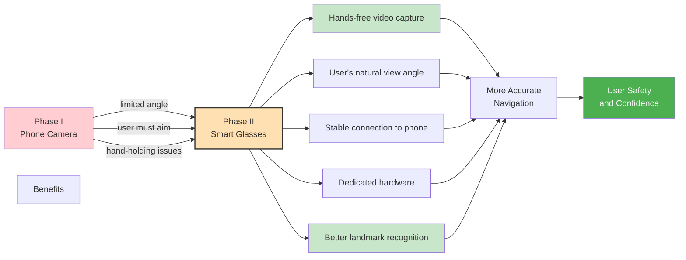

### Technical Innovation

| Aspect | Phase I | Phase II | Improvement |
|--------|---------|----------|------------|
| **Video Source** | Smartphone camera (variable angle) | Smart glasses camera (consistent view) | Consistent perspective for landmark recognition |
| **Hands** | User must hold phone | Hands free while walking | Improved safety and navigation confidence |
| **Field of View** | User adjusts angle | Natural eye-level view | Better environmental awareness |
| **Stability** | Held in hand (prone to drops) | Worn on glasses frame | Secure, stable attachment |
| **Processing Power** | Phone processes alone | Phone plus offload to glasses | Better performance and battery life |
